# 第06章 通用权限系统企业应用指南

## 1. 新项目开发

如果是新项目开发，可以在品达通用权限系统的基础上进行相关的业务开发，其实就是将通用权限系统当做开发脚手架在此基础之上快速开始业务开发。

下面以一个商品服务为案例，如何基于品达通用权限系统进行新业务的开发。

### 1.1. 数据库环境搭建

创建 pd_goods 数据库

```sql
CREATE DATABASE `pd_goods` CHARACTER SET utf8mb4 COLLATE utf8mb4_general_ci;
```

导入项目资料中的建表脚本 pinda-authority-project\document\sql\pd_goods_info.sql 创建 pd_goods_info 表。

### 1.2. 后端业务功能开发

#### 1.2.1. 创建工程

在品达通用权限系统基础上创建商品服务相关模块，如下图：

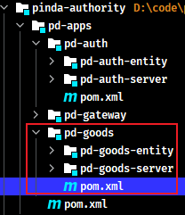

```
pd-goods              # 商品服务父工程
├── pd-goods-entity	  # 实体
└── pd-goods-server	  # 服务
```

#### 1.2.2. pd-goods-entity 工程开发

- 配置工程 pom.xml

```xml
<dependencies>
    <dependency>
        <groupId>com.moon</groupId>
        <artifactId>pd-tools-common</artifactId>
    </dependency>
    <dependency>
        <groupId>io.springfox</groupId>
        <artifactId>springfox-core</artifactId>
    </dependency>
    <dependency>
        <groupId>com.baomidou</groupId>
        <artifactId>mybatis-plus</artifactId>
    </dependency>
</dependencies>
```

- 创建商品实体类

```java
package com.moon.pinda.goods.entity;

import com.baomidou.mybatisplus.annotation.TableName;
import com.moon.pinda.base.entity.Entity;
import lombok.AllArgsConstructor;
import lombok.Data;
import lombok.EqualsAndHashCode;
import lombok.NoArgsConstructor;
import lombok.ToString;
import lombok.experimental.Accessors;

import java.math.BigDecimal;
import java.time.LocalDateTime;

/**
 * 商品实体类
 */
@Data
@NoArgsConstructor
@AllArgsConstructor
@ToString(callSuper = true)
@EqualsAndHashCode(callSuper = true)
@Accessors(chain = true)
@TableName("pd_goods_info")
public class GoodsInfo extends Entity<Long> {
    /**
     * 商品编码
     */
    private String code;

    /**
     * 商品名称
     */
    private String name;

    /**
     * 国条码
     */
    private String barCode;

    /**
     * 品牌表id
     */
    private Integer brandId;

    /**
     * 一级分类id
     */
    private Integer oneCategoryId;

    /**
     * 二级分类id
     */
    private Integer twoCategoryId;

    /**
     * 三级分类id
     */
    private Integer threeCategoryId;

    /**
     * 商品的供应商id
     */
    private Integer supplierId;

    /**
     * 商品售价价格
     */
    private BigDecimal price;

    /**
     * 商品加权平均成本
     */
    private BigDecimal averageCost;

    /**
     * 上下架状态:0下架，1上架
     */
    private boolean publishStatus;

    /**
     * 审核状态: 0未审核，1已审核
     */
    private boolean auditStatus;

    /**
     * 商品重量
     */
    private Float weight;

    /**
     * 商品长度
     */
    private Float length;

    /**
     * 商品重量
     */
    private Float height;

    /**
     * 商品宽度
     */
    private Float width;

    /**
     * 颜色
     */
    private String color;

    /**
     * 生产日期
     */
    private LocalDateTime productionDate;

    /**
     * 商品有效期
     */
    private Integer shelfLife;

    /**
     * 商品描述
     */
    private String descript;
}
```

- 创建商品操作对应的请求 DTO 类

```java
@Data
@NoArgsConstructor
@AllArgsConstructor
@ToString(callSuper = true)
@EqualsAndHashCode(callSuper = true)
@Accessors(chain = true)
public class GoodsInfoPageDTO extends GoodsInfo {
    private LocalDateTime startCreateTime;
    private LocalDateTime endCreateTime;
}

public class GoodsInfoSaveDTO extends GoodsInfo {
}

public class GoodsInfoUpdateDTO extends GoodsInfo {
}
```

#### 1.2.3. pd-goods-server 工程开发

- 配置 pom.xml 文件

```xml
<dependencies>
    <dependency>
        <groupId>com.moon</groupId>
        <artifactId>pd-tools-log</artifactId>
    </dependency>
    <dependency>
        <groupId>com.moon</groupId>
        <artifactId>pd-tools-swagger2</artifactId>
    </dependency>
    <dependency>
        <groupId>com.moon</groupId>
        <artifactId>pd-tools-validator</artifactId>
    </dependency>
    <dependency>
        <groupId>com.moon</groupId>
        <artifactId>pd-tools-xss</artifactId>
    </dependency>
    <dependency>
        <groupId>com.alibaba.cloud</groupId>
        <artifactId>spring-cloud-starter-alibaba-nacos-discovery</artifactId>
        <exclusions>
            <exclusion>
                <artifactId>fastjson</artifactId>
                <groupId>com.alibaba</groupId>
            </exclusion>
            <exclusion>
                <groupId>com.google.guava</groupId>
                <artifactId>guava</artifactId>
            </exclusion>
        </exclusions>
    </dependency>
    <dependency>
        <groupId>org.springframework.cloud</groupId>
        <artifactId>spring-cloud-starter-netflix-hystrix</artifactId>
        <exclusions>
            <exclusion>
                <groupId>com.google.guava</groupId>
                <artifactId>guava</artifactId>
            </exclusion>
        </exclusions>
    </dependency>
    <dependency>
        <groupId>org.springframework.cloud</groupId>
        <artifactId>spring-cloud-starter-openfeign</artifactId>
        <exclusions>
            <exclusion>
                <groupId>com.google.guava</groupId>
                <artifactId>guava</artifactId>
            </exclusion>
        </exclusions>
    </dependency>
    <dependency>
        <groupId>org.ow2.asm</groupId>
        <artifactId>asm</artifactId>
        <version>${asm.version}</version>
    </dependency>
    <dependency>
        <groupId>org.springframework.boot</groupId>
        <artifactId>spring-boot-starter-web</artifactId>
        <exclusions>
            <exclusion>
                <groupId>org.apache.tomcat.embed</groupId>
                <artifactId>tomcat-embed-websocket</artifactId>
            </exclusion>
            <exclusion>
                <groupId>org.springframework.boot</groupId>
                <artifactId>spring-boot-starter-tomcat</artifactId>
            </exclusion>
        </exclusions>
    </dependency>
    <dependency>
        <groupId>org.springframework.boot</groupId>
        <artifactId>spring-boot-starter-undertow</artifactId>
    </dependency>
    <dependency>
        <groupId>org.springframework.boot</groupId>
        <artifactId>spring-boot-starter-aop</artifactId>
    </dependency>
    <dependency>
        <groupId>org.springframework.boot</groupId>
        <artifactId>spring-boot-starter-actuator</artifactId>
    </dependency>
    <dependency>
        <groupId>org.springframework.boot</groupId>
        <artifactId>spring-boot-starter-json</artifactId>
    </dependency>
    <dependency>
        <groupId>org.springframework.boot</groupId>
        <artifactId>spring-boot-starter-test</artifactId>
        <scope>test</scope>
    </dependency>
    <dependency>
        <groupId>com.moon</groupId>
        <artifactId>pd-tools-databases</artifactId>
    </dependency>
    <dependency>
        <groupId>com.moon</groupId>
        <artifactId>pd-tools-dozer</artifactId>
    </dependency>
    <dependency>
        <groupId>org.springframework.cloud</groupId>
        <artifactId>spring-cloud-context</artifactId>
    </dependency>
    <dependency>
        <groupId>com.baomidou</groupId>
        <artifactId>mybatis-plus-boot-starter</artifactId>
    </dependency>
    <dependency>
        <groupId>org.springframework.boot</groupId>
        <artifactId>spring-boot-configuration-processor</artifactId>
        <optional>true</optional>
        <scope>compile</scope>
    </dependency>
    <dependency>
        <groupId>com.moon</groupId>
        <artifactId>pd-goods-entity</artifactId>
        <version>1.0-SNAPSHOT</version>
    </dependency>
</dependencies>

<build>
    <resources>
        <resource>
            <directory>src/main/resources</directory>
            <filtering>true</filtering>
        </resource>
    </resources>
    <plugins>
        <plugin>
            <groupId>org.springframework.boot</groupId>
            <artifactId>spring-boot-maven-plugin</artifactId>
            <executions>
                <execution>
                    <goals>
                        <goal>repackage</goal>
                    </goals>
                </execution>
            </executions>
        </plugin>
    </plugins>
</build>
```

- 参考 pd-auth-server 工程，准备以下配置文件。修改配置中为本工程的包路径即可

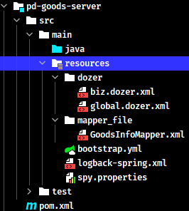

- 在配置中心 Nacos 中创建 pd-goods-server.yml

```yml
# 在这里配置 商品服务 所有环境都能使用的配置
pinda:
  mysql:
    database: pd_goods
  swagger:
    enabled: true
    docket:
      core:
        title: 核心模块
        base-package: com.moon.pinda.goods.controller

server:
  port: 8767
```


- 参考 pd-auth-server 工程，创建以下配置类，只需要修改包路径即可

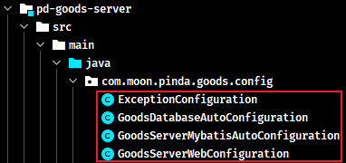

- 创建 Mapper 接口

```java
@Repository
public interface GoodsInfoMapper extends BaseMapper<GoodsInfo> {
}
```

- 创建 Service 接口和实现类

```java
package com.moon.pinda.goods.service;

import com.baomidou.mybatisplus.extension.service.IService;
import com.moon.pinda.goods.entity.GoodsInfo;

/**
 * 商品业务接口
 */
public interface GoodsInfoService extends IService<GoodsInfo> {
}
```

```java
package com.moon.pinda.goods.service.impl;

import com.baomidou.mybatisplus.extension.service.impl.ServiceImpl;
import com.moon.pinda.goods.dao.GoodsInfoMapper;
import com.moon.pinda.goods.entity.GoodsInfo;
import com.moon.pinda.goods.service.GoodsInfoService;
import org.springframework.stereotype.Service;

/**
 * 商品业务接口实现
 */
@Service
public class GoodsInfoServiceImpl extends ServiceImpl<GoodsInfoMapper, GoodsInfo> implements GoodsInfoService {
}
```

- 创建 Controller，复制了一些基础的 CRUD 代码

```java
package com.moon.pinda.goods.controller;

import com.baomidou.mybatisplus.core.metadata.IPage;
import com.baomidou.mybatisplus.extension.plugins.pagination.Page;
import com.moon.pinda.base.BaseController;
import com.moon.pinda.base.R;
import com.moon.pinda.base.entity.SuperEntity;
import com.moon.pinda.database.mybatis.conditions.Wraps;
import com.moon.pinda.database.mybatis.conditions.query.LbqWrapper;
import com.moon.pinda.dozer.DozerUtils;
import com.moon.pinda.goods.dto.GoodsInfoPageDTO;
import com.moon.pinda.goods.dto.GoodsInfoSaveDTO;
import com.moon.pinda.goods.dto.GoodsInfoUpdateDTO;
import com.moon.pinda.goods.entity.GoodsInfo;
import com.moon.pinda.goods.service.GoodsInfoService;
import com.moon.pinda.log.annotation.SysLog;
import io.swagger.annotations.Api;
import io.swagger.annotations.ApiImplicitParam;
import io.swagger.annotations.ApiImplicitParams;
import io.swagger.annotations.ApiOperation;
import lombok.extern.slf4j.Slf4j;
import org.springframework.beans.factory.annotation.Autowired;
import org.springframework.validation.annotation.Validated;
import org.springframework.web.bind.annotation.DeleteMapping;
import org.springframework.web.bind.annotation.GetMapping;
import org.springframework.web.bind.annotation.PathVariable;
import org.springframework.web.bind.annotation.PostMapping;
import org.springframework.web.bind.annotation.PutMapping;
import org.springframework.web.bind.annotation.RequestBody;
import org.springframework.web.bind.annotation.RequestMapping;
import org.springframework.web.bind.annotation.RequestParam;
import org.springframework.web.bind.annotation.RestController;

import java.util.List;

/**
 * 商品控制层
 */
@Slf4j
@Validated
@RestController
@RequestMapping("/goodsInfo")
@Api(value = "GoodsInfo", tags = "商品信息")
public class GoodsInfoController extends BaseController {

    @Autowired
    private DozerUtils dozerUtils;
    @Autowired
    private GoodsInfoService goodsInfoService;

    /**
     * 分页查询商品信息
     *
     * @param data 分页查询对象
     * @return 查询结果
     */
    @ApiOperation(value = "分页查询商品信息", notes = "分页查询商品信息")
    @ApiImplicitParams({
            @ApiImplicitParam(name = "current", value = "当前页", dataType = "long", paramType = "query", defaultValue = "1"),
            @ApiImplicitParam(name = "size", value = "每页显示几条", dataType = "long", paramType = "query", defaultValue = "10"),
    })
    @GetMapping("/page")
    @SysLog("分页查询商品信息")
    public R<IPage<GoodsInfo>> page(GoodsInfoPageDTO data) {
        Page<GoodsInfo> page = getPage();
        LbqWrapper<GoodsInfo> wrapper = Wraps.lbQ();

        wrapper.like(GoodsInfo::getName, data.getName())
                .like(GoodsInfo::getCode, data.getCode())
                .eq(GoodsInfo::getBarCode, data.getBarCode())
                .geHeader(GoodsInfo::getCreateTime, data.getStartCreateTime())
                .leFooter(GoodsInfo::getCreateTime, data.getEndCreateTime())
                .orderByDesc(GoodsInfo::getCreateTime);

        goodsInfoService.page(page, wrapper);
        return success(page);
    }

    @ApiOperation(value = "查询商品信息", notes = "查询商品信息")
    @GetMapping("/list")
    @SysLog("查询商品信息")
    public R<List<GoodsInfo>> list(GoodsInfoPageDTO data) {

        LbqWrapper<GoodsInfo> wrapper = Wraps.lbQ();

        wrapper.like(GoodsInfo::getName, data.getName())
                .like(GoodsInfo::getCode, data.getCode())
                .eq(GoodsInfo::getBarCode, data.getBarCode())
                .geHeader(GoodsInfo::getCreateTime, data.getStartCreateTime())
                .leFooter(GoodsInfo::getCreateTime, data.getEndCreateTime())
                .orderByDesc(GoodsInfo::getCreateTime);

        return success(goodsInfoService.list(wrapper));
    }

    /**
     * 查询商品信息
     *
     * @param id 主键id
     * @return 查询结果
     */
    @ApiOperation(value = "查询商品信息", notes = "查询商品信息")
    @GetMapping("/{id}")
    @SysLog("查询商品信息")
    public R<GoodsInfo> get(@PathVariable Long id) {
        return success(goodsInfoService.getById(id));
    }

    /**
     * 新增商品信息
     *
     * @param data 新增对象
     * @return 新增结果
     */
    @ApiOperation(value = "新增商品信息", notes = "新增商品信息不为空的字段")
    @PostMapping
    @SysLog("新增商品信息")
    public R<GoodsInfo> save(@RequestBody @Validated GoodsInfoSaveDTO data) {
        GoodsInfo GoodsInfo = dozerUtils.map(data, GoodsInfo.class);
        goodsInfoService.save(GoodsInfo);
        return success(GoodsInfo);
    }

    /**
     * 修改商品信息
     *
     * @param data 修改对象
     * @return 修改结果
     */
    @ApiOperation(value = "修改商品信息", notes = "修改商品信息不为空的字段")
    @PutMapping
    @SysLog("修改商品信息")
    public R<GoodsInfo> update(@RequestBody @Validated(SuperEntity.Update.class) GoodsInfoUpdateDTO data) {
        GoodsInfo GoodsInfo = dozerUtils.map(data, GoodsInfo.class);
        goodsInfoService.updateById(GoodsInfo);
        return success(GoodsInfo);
    }

    /**
     * 删除商品信息
     *
     * @param ids 主键id
     * @return 删除结果
     */
    @ApiOperation(value = "删除商品信息", notes = "根据id物理删除商品信息")
    @SysLog("删除商品信息")
    @DeleteMapping
    public R<Boolean> delete(@RequestParam("ids[]") List<Long> ids) {
        goodsInfoService.removeByIds(ids);
        return success();
    }
}
```

- 创建项目启动类，标识相关注解来开启不同的功能

```java
package com.moon.pinda;

import com.moon.pinda.validator.config.EnableFormValidator;
import lombok.extern.slf4j.Slf4j;
import org.springframework.boot.SpringApplication;
import org.springframework.boot.autoconfigure.SpringBootApplication;
import org.springframework.cloud.client.discovery.EnableDiscoveryClient;
import org.springframework.cloud.netflix.hystrix.EnableHystrix;
import org.springframework.cloud.openfeign.EnableFeignClients;
import org.springframework.context.ConfigurableApplicationContext;
import org.springframework.core.env.Environment;
import org.springframework.transaction.annotation.EnableTransactionManagement;

import java.net.InetAddress;
import java.net.UnknownHostException;

@SpringBootApplication
@EnableDiscoveryClient
@EnableHystrix
@EnableFeignClients(value = {"com.moon.pinda"})
@EnableTransactionManagement
@Slf4j
@EnableFormValidator
public class GoodsServerApplication {
    public static void main(String[] args) throws UnknownHostException {
        ConfigurableApplicationContext application = SpringApplication.run(GoodsServerApplication.class, args);
        Environment env = application.getEnvironment();
        log.info("\n----------------------------------------------------------\n" +
                        "\t应用 '{}' 运行成功! 访问连接:\n" +
                        "\tSwagger文档: \t\thttp://{}:{}/doc.html\n" +
                        "----------------------------------------------------------",
                env.getProperty("spring.application.name"),
                InetAddress.getLocalHost().getHostAddress(),
                env.getProperty("server.port"));

    }
}
```

### 1.3. 配置网关路由规则

在 Nacos 配置中心的 pd-gateway.yml 中新增商品服务相关的路由配置，内容如下：

```yml
zuul:
  routes:  # 路由配置方式
    # 省略...
    goods: # 商品服务
      path: /goods/**
      serviceId: pd-goods-server
```

### 1.4. 前端开发

可以将本项目中的 pinda-authority-ui 作为前端开发脚手架，基于此工程开发商品服务相关页面，本项目中已经提供直接运行即可。

#### 1.4.1. 配置菜单和资源权限

启动网关服务、权限服务、商品服务、前端工程，使用管理员账号登录，配置商品服务相关的菜单和对应的资源权限。

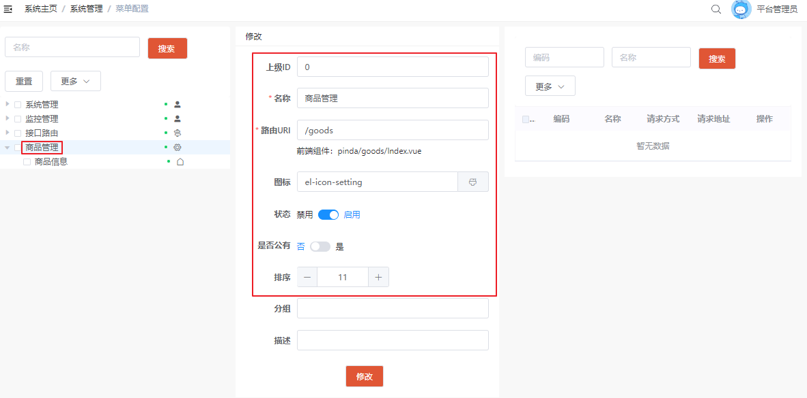

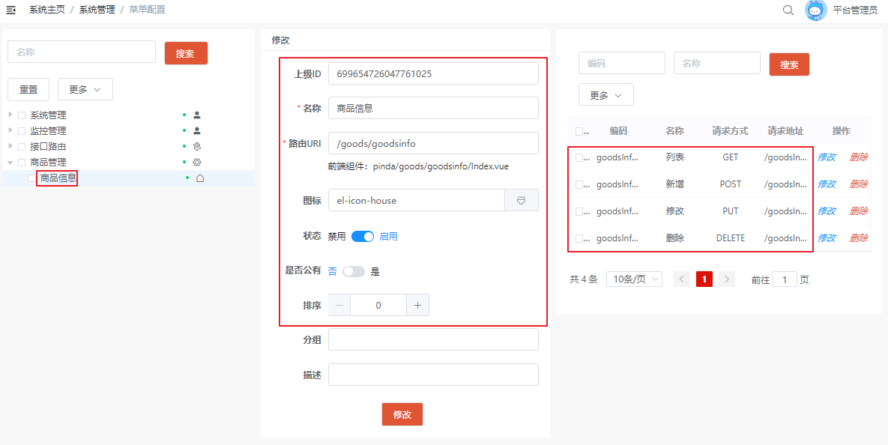

#### 1.4.2. 配置角色

启动网关服务和权限服务，使用管理员账号登录。创建新角色并进行配置(菜单权限和资源权限)和授权(为用户分配角色)。


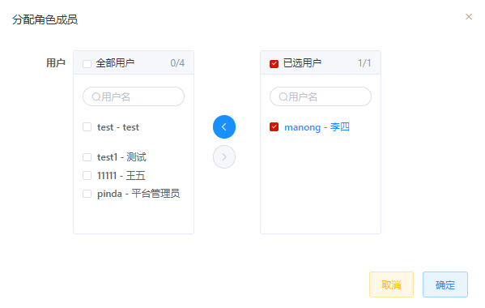

## 2. 已有项目集成

本章节通过已经完成开发的TMS(品达物流)项目来展示如何进行已有项目集成的过程。

### 2.1. TMS 调整

#### 2.1.1. 页面菜单

对于已经完成相关业务开发的项目，可以将其前端系统的页面通过 iframe 的形式内嵌到通用权限系统的前端页面中，这就需要对其前端系统的页面进行相应的修改。因为原来的 TMS 系统前端页面的左侧菜单和导航菜单都在自己页面中展示，现在需要将这些菜单配置到通用权限系统中，通过权限系统的前端系统来展示。

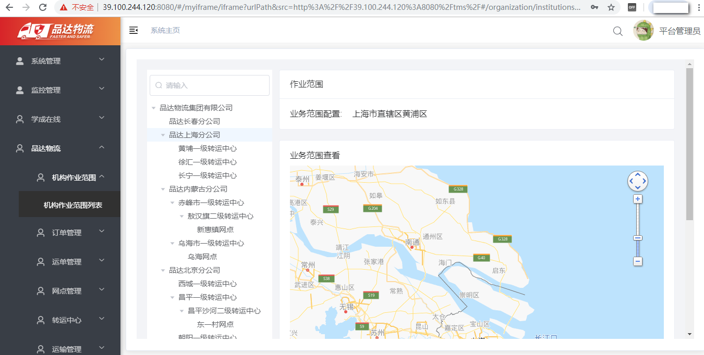

#### 2.1.2. 后端服务请求代理

为了能够进行鉴权相关处理，需要将 TMS 前端发送的请求首先经过通用权限系统的网关进行处理：

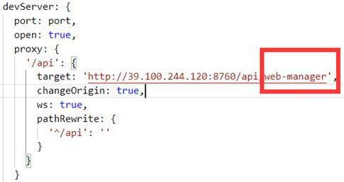

### 2.2. 网关路由配置

配置通用权限系统的网关路由规则，将针对TMS的请求转发到TMS相关服务：

```yml
zuul:
  retryable: false
  servlet-path: /
  ignored-services: "*"   # 忽略eureka上的所有服务
  sensitive-headers:  # 一些比较敏感的请求头，不想通过zuul传递过去， 可以通过该属性进行设置
  routes:  # 路由配置方式
    authority: 
      path: /authority/**
      serviceId: pd-auth-server
    pay:
      path: /pay/**
      serviceId: pd-ofpay-server
    web-manager:
      path: /web-manager/**
      serviceId: pd-web-manager
    web-xczx:
      path: /xczx/api/**
      url: http://xc.moon.net:7291/api/
```

> <font color=purple>**Tips: 以上服务如果是在同一个注册中心时，可以通过 `serviceId` 来配置转发；但如果服务不在同一个注册中心时，则可以通过 `url` 来直接指定请求转发的请求地址**</font>

### 2.3. 通用权限系统配置

#### 2.3.1. 菜单配置

登录通用权限系统，配置TMS项目相应的菜单：

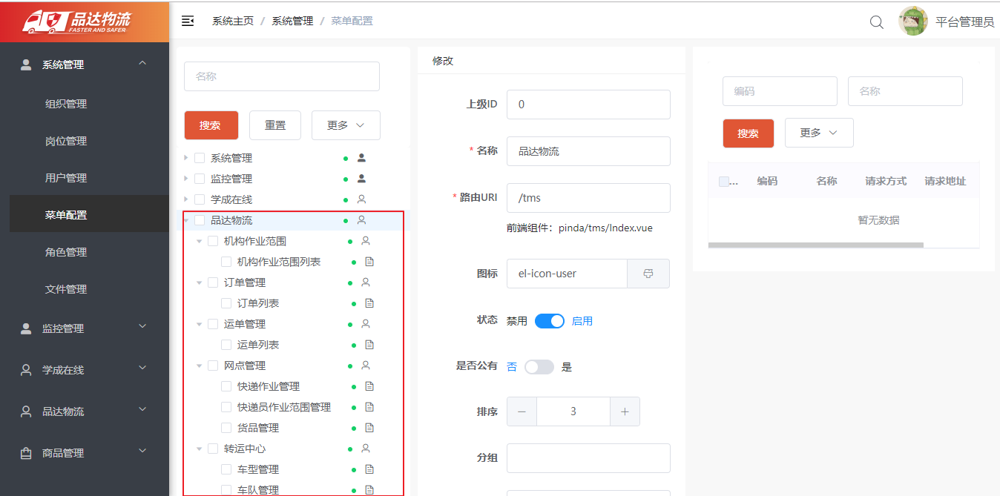

#### 2.3.2. 资源权限配置

资源权限都是关联到某个菜单下的，所以要配置资源权限需要先选中某个菜单，然后就可以配置相关资源权限了：

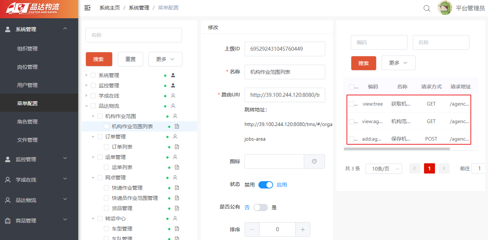

#### 2.3.3. 角色配置

登录通用权限系统，在角色管理菜单中配置TMS项目中使用到的角色：

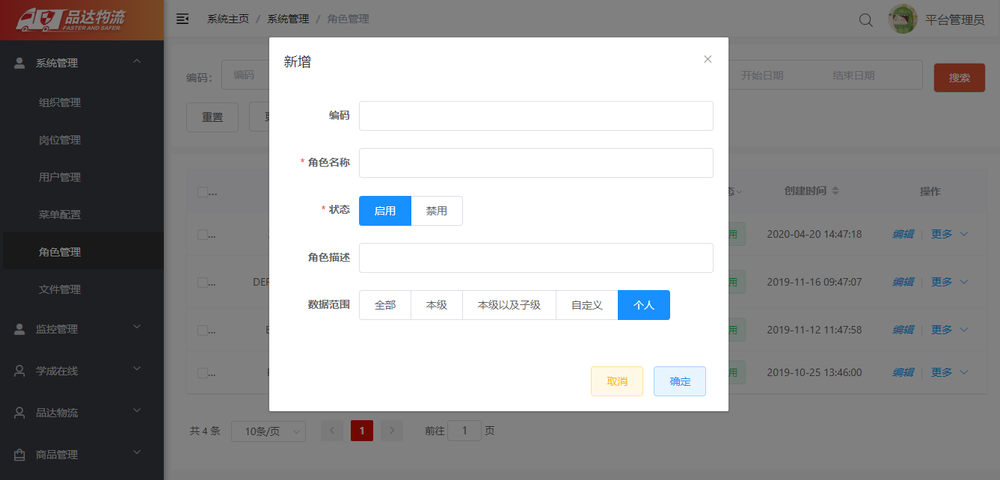

角色创建完成后可以为角色配置菜单权限和资源权限：

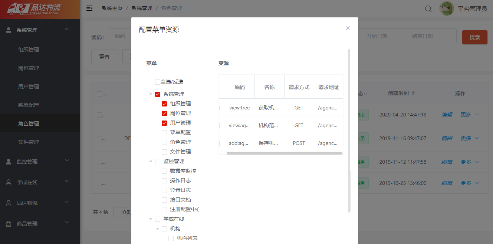

完成角色的菜单权限和资源权限配置后可以将角色授权给用户：

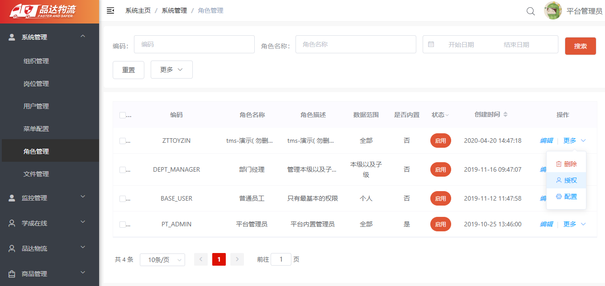

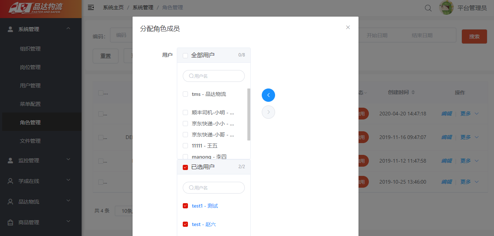
