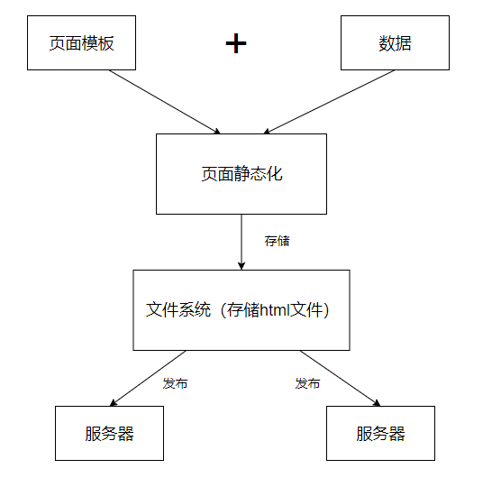
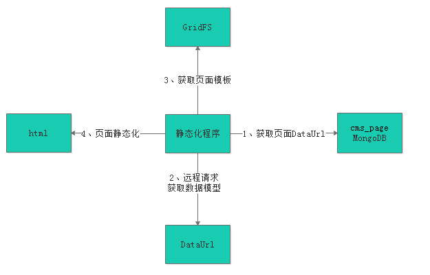
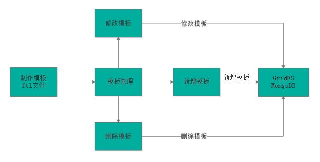
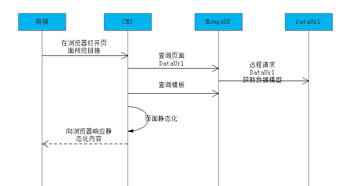

## 1. 页面静态化需求

1. 为什么要进行页面管理？
    - 本项目cms系统的功能就是根据运营需要，对门户等子系统的部分页面进行管理，从而实现快速根据用户需求修改页面内容并上线的需求
2. 如何修改页面的内容？
    - 在开发中修改页面内容是需要人工编写html及JS文件，CMS系统是通过程序自动化的对页面内容进行修改，通过页面静态化技术生成html页面。
3. 如何对页面进行静态化？
    - 一个页面等于模板加数据，在添加页面的时候我们选择了页面的模板。
    - 页面静态化就是将页面模板和数据通过技术手段将二者合二为一，生成一个html网页文件。
4. 页面静态化及页面发布流程图如下

    

    - 业务流程如下：
        1. 获取模型数据
        2. 制作模板
        3. 对页面进行静态化
        4. 将静态化生成的html页面存放文件系统中
        5. 将存放在文件系统的html文件发布到服务器

## 2. FreeMarker 模版引擎
### 2.1. FreeMarker 介绍

详细内容可参考“学成在线-freemarker.pdf”

### 2.2. FreeMarker 快速入门
#### 2.2.1. 创建测试工程

创建一个 freemarker 的测试工程专门用于freemarker的功能测试与模板的测试，配置pom.xml文件依赖

```xml
<?xml version="1.0" encoding="UTF-8"?>
<project xmlns="http://maven.apache.org/POM/4.0.0"
         xmlns:xsi="http://www.w3.org/2001/XMLSchema-instance"
         xsi:schemaLocation="http://maven.apache.org/POM/4.0.0
         http://maven.apache.org/xsd/maven-4.0.0.xsd">
    <parent>
        <artifactId>xc-framework-parent</artifactId>
        <groupId>com.xuecheng</groupId>
        <version>1.0-SNAPSHOT</version>
        <relativePath>../xc-framework-parent/pom.xml</relativePath>
    </parent>
    <modelVersion>4.0.0</modelVersion>
    <artifactId>test-freemarker</artifactId>
    <packaging>jar</packaging>
    <name>test-freemarker</name>

    <dependencies>
        <dependency>
            <groupId>org.springframework.boot</groupId>
            <artifactId>spring-boot-starter-freemarker</artifactId>
        </dependency>
        <dependency>
            <groupId>org.springframework.boot</groupId>
            <artifactId>spring-boot-starter-web</artifactId>
        </dependency>
        <dependency>
            <groupId>org.projectlombok</groupId>
            <artifactId>lombok</artifactId>
        </dependency>
        <dependency>
            <groupId>com.squareup.okhttp3</groupId>
            <artifactId>okhttp</artifactId>
        </dependency>
        <dependency>
            <groupId>org.springframework.boot</groupId>
            <artifactId>spring-boot-starter-test</artifactId>
        </dependency>
        <dependency>
            <groupId>org.apache.commons</groupId>
            <artifactId>commons-io</artifactId>
        </dependency>
    </dependencies>
</project>
```

#### 2.2.2. 配置文件

配置application.yml 和 logback-spring.xml，从cms工程拷贝这两个文件进行更改，logback-spring.xml无需更改，application.yml内容如下：

```yml
server:
  port: 8088  # 服务端口
spring:
  application:
    name: test‐freemarker # 指定应用名称
  freemarker:
    cache: false  # 关闭模板缓存，方便测试
    settings:
      template_update_delay: 0  # 检查模板更新延迟时间，设置为0表示立即检查，如果时间大于0会有缓存不方便进行模板测试
```

#### 2.2.3. 创建模型类

在freemarker的测试工程下创建模型类型用于测试

```java
@Data
@ToString
public class Student {
    private String name;            // 姓名
    private int age;                // 年龄
    private Date birthday;          // 生日
    private Float mondy;            // 钱包
    private List<Student> friends;  // 朋友列表
    private Student bestFriend;     // 最好的朋友
}
```

#### 2.2.4. 创建模板

- 在 src/main/resources下创建templates，此目录为freemarker的默认模板存放目录
- 在templates下创建模板文件test1.ftl，模板中的${name}最终会被freemarker替换成具体的数据

```ftl
<!DOCTYPE html>
<html>
<head>
    <meta charset="utf-8">
    <title>Hello World!</title>
</head>
<body>
Hello ${name}!
</body>
</html>
```

#### 2.2.5. 创建controller

创建Controller类，向Map中添加name，最后返回模板文件

```java
@Controller // 此处需要注意，不能使用@RestController注解，因为需要输出html页面，而@RestController是输出json数据
@RequestMapping("/freemarker")
public class FreemarkerController {

    /* 注入restTemplate，用于进行http请求 */
    @Autowired
    private RestTemplate restTemplate;

    /**
     * freemarker模版+数据生成html页面测试
     *
     * @param map
     * @return
     */
    @RequestMapping("/test1")
    public String freemarker(Map<String, Object> map) {
        // 设置数据模型，此map是freemarker模板所使用的数据
        map.put("name", "月の哀傷");
        // 返回模板文件名称，这个freemarker模板的位置，是基于resources/templastes路径下
        return "test1";
    }
}
```

#### 2.2.6. 创建启动类

```java
@SpringBootApplication
public class FreemarkerTestApplication {

    public static void main(String[] args) {
        SpringApplication.run(FreemarkerTestApplication.class, args);
    }

    @Bean
    public RestTemplate restTemplate() {
        return new RestTemplate(new OkHttp3ClientHttpRequestFactory());
    }
}
```

#### 2.2.7. 测试

- 请求：http://localhost:8088/freemarker/test1
- 屏幕显示： Hello 月の哀傷!

### 2.3. FreeMarker 基础

详细内容可参考“学成在线-freemarker.pdf”


## 3. GridFS 持久化存储文件的模块
### 3.1. GridFS介绍

- GridFS是MongoDB提供的用于持久化存储文件的模块，CMS使用MongoDB存储数据，使用GridFS可以快速集成开发。
- 工作原理：
    - 在GridFS存储文件是将文件分块存储，文件会按照256KB的大小分割成多个块进行存储，GridFS使用两个集合（collection）存储文件，一个集合是chunks, 用于存储文件的二进制数据；一个集合是files，用于存储文件的元数据信息（文件名称、块大小、上传时间等信息）。
    - 从GridFS中读取文件要对文件的各块进行组装、合并。
- 详细参考：https://docs.mongodb.com/manual/core/gridfs/

### 3.2. GridFS 存取文件测试
#### 3.2.1. 存储文件

在xc-service-manage-cms工程中，创建GridFsTest类，向测试程序注入GridFsTemplate，测试存储文件。

```java
@SpringBootTest
@RunWith(SpringRunner.class)
public class GridFsTest {

    /* 注入GridFS操作对象 */
    @Autowired
    private GridFsTemplate gridFsTemplate;

    /**
     * 存储文件测试
     */
    @Test
    public void testGridFs() throws FileNotFoundException {
        // 获取要存储的文件对象
        File file = new File("E:\\123.jpg");
        // 创建输入流
        FileInputStream inputStream = new FileInputStream(file);
        /*
         * 调用操作对象的store方法，向GridFS存储文件
         *      参数1：存储的文件输入流
         *      参数2：存储的文件名
         *      返回值：文件的存储id
         */
        ObjectId objectId = gridFsTemplate.store(inputStream, "测试存储图片.jpg");
        // 获取存储的文件id（用于查询fs.chunks表中的记录，得到文件的内容）
        String fileId = objectId.toString();
        System.out.println(objectId);
        System.out.println("文件id ==== " + fileId);
    }
}
```

- 存储原理说明：
    - 文件存储成功得到一个文件id
    - 此文件id是fs.files集合中的主键。
    - 可以通过文件id查询fs.chunks表中的记录，得到文件的内容。

#### 3.2.2. 读取文件

1. 在config包中定义Mongodb的配置类，GridFSBucket用于打开下载流对象，配置如下

```java
/**
 * MongoDB 配置类
 */
@Configuration
public class MongoConfig {

    /* 读取配置文件的数据库名称 */
    @Value("${spring.data.mongodb.database}")
    private String db;

    @Bean
    public GridFSBucket getGridFSBucket(MongoClient mongoClient) {
        MongoDatabase database = mongoClient.getDatabase(db);
        GridFSBucket gridFSBucket = GridFSBuckets.create(database);
        return gridFSBucket;
    }
}
```

2. 测试

```java
/* 注入GridFSBucket对象，用于打开下载流对象 */
@Autowired
private GridFSBucket gridFSBucket;

/**
 * 查询文件测试
 */
@Test
public void queryFile() throws IOException {
    // 根据文件id查询文件
    GridFSFile gridFSFile = gridFsTemplate.findOne(Query
            .query(Criteria.where("_id").is("5ce2839e6ea6f70090a77d3b")));

    // 打开下载流对象
    GridFSDownloadStream gridFSDownloadStream = gridFSBucket.openDownloadStream(gridFSFile.getId());

    // 创建GridFsResource对象，用于获取流对象
    GridFsResource gridFsResource = new GridFsResource(gridFSFile, gridFSDownloadStream);

    // 从流中取数据
    String content = IOUtils.toString(gridFsResource.getInputStream(), "UTF-8");
    System.out.println(content);
}
```

#### 3.2.3. 删除文件

```java
/**
 * 测试删除
 */
@Test
public void testDelete() {
    // 根据文件id删除fs.files和fs.chunks中的记录
    gridFsTemplate.delete(Query.query(Criteria.where("_id").is("5ce2839e6ea6f70090a77d3b")));
}
```

## 4. 页面静态化
### 4.1. 页面静态化流程

通过上边对FreeMarker的研究我们得出：**模板+数据模型=输出**，页面静态化需要准备数据模型和模板，先知道数据模型的结构才可以编写模板，因为在模板中要引用数据模型中的数据，本节将系统讲解CMS页面数据模型获取、模板管理及静态化的过程。

- 如何获取页面的数据模型？
    - CMS管理了各种页面，CMS对页面进行静态化时需要数据模型，但是CMS并不知道每个页面的数据模型的具体内容，它只管执行静态化程序便可对页面进行静态化，所以CMS静态化程序需要通过一种通用的方法来获取数据模型。
    - 在编辑页面信息时指定一个DataUrl，此DataUrl便是获取数据模型的Url，它基于Http方式，CMS对页面进行静态化时会从页面信息中读取DataUrl，通过Http远程调用的方法请求DataUrl获取数据模型。
- 管理员怎么知道DataUrl的内容呢？举例说明：
    - 此页面是轮播图页面，它的DataUrl由开发轮播图管理的程序员提供。
    - 此页面是精品课程推荐页面，它的DataUrl由精品课程推荐的程序员提供。
    - 此页面是课程详情页面，它的DataUrl由课程管理的程序员提供。
    - 页面静态化流程如下图：
        1. 静态化程序首先读取页面获取DataUrl。
        2. 静态化程序远程请求DataUrl得到数据模型。
        3. 获取页面模板。
        4. 执行页面静态化。



### 4.2. 数据模型
#### 4.2.1. 轮播图DataUrl接口
##### 4.2.1.1. 需求分析

- CMS中有轮播图管理、精品课程推荐的功能，以轮播图管理为例说明：轮播图管理是通过可视化的操作界面由管理员指定轮播图图片地址，最后将轮播图图片地址保存在cms_config集合中，下边是轮播图数据模型

```json
{
    "_id" : ObjectId("5a791725dd573c3574ee333f"),
    "_class" : "com.xuecheng.framework.domain.cms.CmsConfig",
    "name" : "轮播图",
    "model" : [
        {
            "key" : "banner1",
            "name" : "轮播图1地址",
            "value" : "http://192.168.101.64/group1/M00/00/01/wKhlQFp5wnCAG-kAAATMXxpSaMg864.png"
        },
        {
            "key" : "banner2",
            "name" : "轮播图2地址",
            "value" : "http://192.168.101.64/group1/M00/00/01/wKhlQVp5wqyALcrGAAGUeHA3nvU867.jpg"
        },
        {
            "key" : "banner3",
            "name" : "轮播图3地址",
            "value" : "http://192.168.101.64/group1/M00/00/01/wKhlQFp5wtWAWNY2AAIkOHlpWcs395.jpg"
        }
    ]
}
```

- 针对首页的轮播图信息、精品推荐等信息的获取统一提供一个Url供静态化程序调用，这样我们就知道了轮播图页面、精品课程推荐页面的DataUrl，管理在页面配置中将此Url配置在页面信息中。
- 本小节开发一个查询轮播图、精品推荐信息的接口，此接口供静态化程序调用获取数据模型。

##### 4.2.1.2. 接口定义

轮播图信息、精品推荐等信息存储在MongoDB的cms_config集合中

- cms_config有固定的数据结构实体类

```java
@Data
@ToString
@Document(collection = "cms_config")
public class CmsConfig {
    @Id
    private String id;      // 主键
    private String name;    // 数据模型的名称
    private List<CmsConfigModel> model; // 数据模型项目
}
```

- 数据模型项目实体类

```java
@Data
@ToString
public class CmsConfigModel {
    private String key;     // 主键
    private String name;    // 项目名称
    private String url;     // 项目url
    private Map mapValue;   // 项目复杂值
    private String value;   // 项目简单值
}
```

- 上边的模型结构可以对照cms_config中的数据进行分析。其中，**在 mapValue 中可以存储一些复杂的数据模型内容**。
- 根据配置信息Id查询配置信息，定义接口 CmsConfigControllerApi 如下：

```java
/**
 * cms配置管理接口
 */
@Api(value = "cms配置管理接口", description = "cms配置管理接口，提供数据模型的管理、查询接口")
public interface CmsConfigControllerApi {

    @ApiOperation("根据id查询CMS配置信息")
    public CmsConfig getModel(String id);

}
```

##### 4.2.1.3. Dao 层

定义CmsConfig的dao接口

```java
/**
 * 页面配置服务dao接口
 */
public interface CmsConfigRepository extends MongoRepository<CmsConfig, String> {
}
```

##### 4.2.1.4. Service 层

~~创建CmsConfigService类，创建根据id查询CmsConfig信息~~

在PageService类，创建根据id查询CmsConfig信息方法

```java
@Service
public class PageService {
    ......
    /* 注入页面配置dao层 */
    @Autowired
    private CmsConfigRepository cmsConfigRepository;

    ......

    /**
     * 根据id查询cmsConfig
     *
     * @param id
     * @return
     */
    public CmsConfig getConfigById(String id) {
        Optional<CmsConfig> optional = cmsConfigRepository.findById(id);
        if (optional.isPresent()) {
            CmsConfig cmsConfig = optional.get();
            return cmsConfig;
        }
        return null;
    }
}
```

##### 4.2.1.5. Controller 层

```java
/**
 * 页面配置控制层
 */
@RestController
@RequestMapping("/cms/config")
public class CmsConfigController implements CmsConfigControllerApi {

    /* 注入页面服务层 */
    @Autowired
    private PageService pageService;

    /**
     * 根据id查询CMS配置信息
     *
     * @param id
     * @return
     */
    @Override
    @GetMapping("/getmodel/{id}")
    public CmsConfig getModel(@PathVariable("id") String id) {
        return pageService.getConfigById(id);
    }
}
```

##### 4.2.1.6. 测试

使用postman测试接口，get请求：http://localhost:31001/cms/config/getmodel/5a791725dd573c3574ee333f

#### 4.2.2. 远程请求接口（RestTemplate）

SpringMVC 提供 RestTemplate 请求http接口，RestTemplate的底层可以使用第三方的http客户端工具实现 http 的请求，常用的http客户端工具有Apache HttpClient、OkHttpClient等，本项目使用 OkHttpClient 完成http请求，原因也是因为它的性能比较出众

1. 在xc-service-manage-cms工程，添加依赖

```xml
<dependency>
    <groupId>com.squareup.okhttp3</groupId>
    <artifactId>okhttp</artifactId>
</dependency>
```

2. 在SpringBoot启动类中配置 RestTemplate

```java
@SpringBootApplication
@EntityScan("com.xuecheng.framework.domain.cms") // 扫描实体类所在包
@ComponentScan(basePackages = {"com.xuecheng.api", "com.xuecheng.framework"}) // 扫描接口，common工程所在包
@ComponentScan(basePackages = {"com.xuecheng.manage_cms"}) // 扫描本项目下的所有类（其实不写好像也是可以扫描的）
public class ManageCmsApplication {

    public static void main(String[] args) {
        SpringApplication.run(ManageCmsApplication.class, args);
    }

    @Bean
    public RestTemplate restTemplate() {
        return new RestTemplate(new OkHttp3ClientHttpRequestFactory());
    }
}
```

3. 启动xc-service-manage-cms工程，测试 RestTemplate，根据url获取数据，并转为map格式

```java
/**
 * RestTemplate测试
 */
@SpringBootTest
@RunWith(SpringRunner.class)
public class RestTemplateTest {

    /* 注入RestTemplateTest对象 */
    @Autowired
    private RestTemplate restTemplate;

    @Test
    public void testRestTemplate() {
        ResponseEntity<Map> forEntity = restTemplate
                .getForEntity("http://localhost:31001/cms/config/getmodel/5a791725dd573c3574ee333f", Map.class);
        Map body = forEntity.getBody();
        System.out.println(body);
    }
}
```

### 4.3. 模板管理
#### 4.3.1. 模板管理业务流程

CMS提供模板管理功能，业务流程如下：



1. 要增加新模板首先需要制作模板，模板的内容就是Freemarker ftl模板内容。
2. 通过模板管理模块功能新增模板、修改模板、删除模板。
3. 模板信息存储在MongoDB数据库，其中模板信息存储在cms_template集合中，模板文件存储在GridFS文件系统中。

cms_template集合：数据结构如下：

```json
{
    "_id" : ObjectId("5a962b52b00ffc514038faf7"),
    "_class" : "com.xuecheng.framework.domain.cms.CmsTemplate",
    "siteId" : "5a751fab6abb5044e0d19ea1",
    "templateName" : "首页",
    "templateParameter" : "",
    "templateFileId" : "5a962b52b00ffc514038faf5"
}
```

上边模板信息中templateFileId是模板文件的ID，此ID对应GridFS文件系统中文件ID

#### 4.3.2. 模板制作
##### 4.3.2.1. 编写模板文件

1. 轮播图页面原型。在门户的静态工程目录有轮播图的静态页面，路径是：/include/index_banner.html
2. 通过 http 请求获取到数据模型

```json
{
    "_id" : ObjectId("5a791725dd573c3574ee333f"),
    "_class" : "com.xuecheng.framework.domain.cms.CmsConfig",
    "name" : "轮播图",
    "model" : [
        {
            "key" : "banner1",
            "name" : "轮播图1地址",
            "url" : null,
            "mapValue" : null,
            "value" : "http://www.xuecheng.com/img/widget-bannerB.jpg"
        },
        {
            "key" : "banner2",
            "name" : "轮播图2地址",
            "url" : null,
            "mapValue" : null,
            "value" : "http://www.xuecheng.com/img/widget-bannerA.jpg"
        },
        {
            "key" : "banner3",
            "name" : "轮播图3地址",
            "url" : null,
            "mapValue" : null,
            "value" : "http://www.xuecheng.com/img/widget-banner3.png"
        }
    ]
}
```

3. 编写模版，在freemarker测试工程中新建模板index_banner.ftl

```ftl
<!DOCTYPE html>
<html lang="en">
<head>
    <meta charset="UTF-8">
    <title>Title</title>
    <link rel="stylesheet" href="http://www.xuecheng.com/plugins/normalize-css/normalize.css"/>
    <link rel="stylesheet" href="http://www.xuecheng.com/plugins/bootstrap/dist/css/bootstrap.css"/>
    <link rel="stylesheet" href="http://www.xuecheng.com/css/page-learing-index.css"/>
    <link rel="stylesheet" href="http://www.xuecheng.com/css/page-header.css"/>
</head>
<body>
<div class="banner-roll">
    <div class="banner-item">
        <#--<div class="item" style="background-image: url(http://www.xuecheng.com/img/widget-bannerB.jpg);"></div>
        <div class="item" style="background-image: url(http://www.xuecheng.com/img/widget-bannerA.jpg);"></div>
        <div class="item" style="background-image: url(http://www.xuecheng.com/img/widget-banner3.png);"></div>
        <div class="item" style="background-image: url(http://www.xuecheng.com/img/widget-bannerB.jpg);"></div>
        <div class="item" style="background-image: url(http://www.xuecheng.com/img/widget-bannerA.jpg);"></div>
        <div class="item" style="background-image: url(http://www.xuecheng.com/img/widget-banner3.png);"></div>-->
        <#if model??>
            <#list model as item>
                <div class="item" style="background-image: url(${item.value});"></div>
            </#list>
        </#if>
    </div>
    <div class="indicators"></div>
</div>
<script type="text/javascript" src="http://www.xuecheng.com/plugins/jquery/dist/jquery.js"></script>
<script type="text/javascript" src="http://www.xuecheng.com/plugins/bootstrap/dist/js/bootstrap.js"></script>
<script type="text/javascript">
    var tg = $('.banner-item .item');
    var num = 0;
    for (i = 0; i < tg.length; i++) {
        $('.indicators').append('<span></span>');
        $('.indicators').find('span').eq(num).addClass('active');
    }

    function roll() {
        tg.eq(num).animate({
            'opacity': '1',
            'z-index': num
        }, 1000).siblings().animate({
            'opacity': '0',
            'z-index': 0
        }, 1000);
        $('.indicators').find('span').eq(num).addClass('active').siblings().removeClass('active');
        if (num >= tg.length - 1) {
            num = 0;
        } else {
            num++;
        }
    }

    $('.indicators').find('span').click(function () {
        num = $(this).index();
        roll();
    });
    var timer = setInterval(roll, 3000);
    $('.banner-item').mouseover(function () {
        clearInterval(timer)
    });
    $('.banner-item').mouseout(function () {
        timer = setInterval(roll, 3000)
    });
</script>
</body>
</html>
```

##### 4.3.2.2. 模板测试

在freemarker测试工程编写一个方法测试轮播图模板

```java
@Controller
@RequestMapping("/freemarker")
public class FreemarkerController {

    /* 注入restTemplate，用于进行http请求 */
    @Autowired
    private RestTemplate restTemplate;

    /**
     * 查询轮播图数据，生成静态页面
     *
     * @param map
     * @return
     */
    @RequestMapping("/banner")
    public String index_banner(Map<String, Object> map) {
        // 使用restTemplate请求轮播图的模型数据
        ResponseEntity<Map> forEntity = restTemplate
                .getForEntity("http://localhost:31001/cms/config/getmodel/5a791725dd573c3574ee333f", Map.class);
        Map body = forEntity.getBody();
        map.putAll(body);
        // 返回模板文件名称
        return "index_banner";
    }
}
```

请求：http://localhost:8088/freemarker/banner

#### 4.3.3. 模板存储

根据模板管理的流程，最终将模板信息存储到MongoDB的cms_template中，将模板文件存储到GridFS中

*模板管理功能此次暂时无实现，手动向cms_template及GridFS中存储模板*

### 4.4. 静态化测试

测试整个页面静态化的流程如下：

1. 填写页面DataUrl。在编辑cms页面信息界面填写DataUrl，将此字段保存到cms_page集合中
2. 静态化程序获取页面的DataUrl
3. 静态化程序远程请求DataUrl获取数据模型
4. 静态化程序获取页面的模板信息
5. 执行页面静态化

#### 4.4.1. 填写页面DataUrl

修改页面管理模板代码，实现编辑页面DataUrl。*注意：此地址由程序员提供给系统管理员，由系统管理员录入到系统中。*

1. 修改页面管理前端的page_edit.vue。在表单中添加 dataUrl 输入框

```html
<el-form-item label="数据Url" prop="dataUrl">
    <el-input v-model="pageForm.dataUrl" auto-complete="off"></el-input>
</el-form-item>
```

```js
data() {
    return {
        ...
        // 新增界面数据
        pageForm: {
            ...
            dataUrl: '',
            ...
        },
        ...
    }
},
```

2. 修改页面管理服务端PageService，在更新cmsPage数据的update方法代码中添加

```java
public CmsPageResult update(String id, CmsPage cmsPage) {
    ...
    // 更新dataUrl
    original.setDataUrl(cmsPage.getDataUrl());
    ...
}
```

#### 4.4.2. 静态化程序

1. 创建模版dao层接口

```java
/**
 * 页面模版服务dao接口
 */
public interface CmsTemplateRepository extends MongoRepository<CmsTemplate, String> {
}
```

2. 在PageService中定义页面静态化相关方法

```java
/**
 * 页面静态化相关方法，流程如下
 * 1. 静态化程序获取页面的DataUrl
 * 2. 静态化程序远程请求DataUrl获取数据模型。
 * 3. 静态化程序获取页面的模板信息
 * 4. 执行页面静态化
 */
/* 获取静态化页面方法 */
public String getPageHtml(String pageId) {

    // 1. 根据上送的页面id，取出页面的信息对象
    CmsPage cmsPage = this.getById(pageId);
    if (cmsPage == null) {
        // 页面不存在，抛出异常
        ExceptionCast.cast(CmsCode.CMS_PAGE_NOTEXISTS);
    }

    // 2. 获取页面的dataUrl，远程请求获取数据模型
    String dataUrl = cmsPage.getDataUrl();
    Map model = getModelByPageId(dataUrl);
    if (model == null) {
        // 数据模型为空
        ExceptionCast.cast(CmsCode.CMS_GENERATEHTML_DATAURLISNULL);
    }

    // 3. 获取页面的模板id，获取页面的模板信息
    String templateId = cmsPage.getTemplateId();
    String template = getTemplateByPageId(templateId);
    if (StringUtils.isBlank(template)) {
        ExceptionCast.cast(CmsCode.CMS_GENERATEHTML_TEMPLATEISNULL);
    }

    // 4. 执行页面静态化
    String html = generateHtml(template, model);
    return html;
}

/* 执行静态化，生成静态页面 */
private String generateHtml(String templateContent, Map model) {
    // 创建配置对象
    Configuration configuration = new Configuration(Configuration.getVersion());

    // 创建模板加载器
    StringTemplateLoader stringTemplateLoader = new StringTemplateLoader();
    stringTemplateLoader.putTemplate("template", templateContent);

    // 向configuration配置模板加载器
    configuration.setTemplateLoader(stringTemplateLoader);

    try {
        // 获取模板
        Template template = configuration.getTemplate("template");
        // 调用api进行静态化
        String content = FreeMarkerTemplateUtils.processTemplateIntoString(template, model);
        return content;
    } catch (Exception e) {
        e.printStackTrace();
    }
    return null;
}

/* 根据模版id，获取页面的模板信息 */
private String getTemplateByPageId(String templateId) {
    if (StringUtils.isBlank(templateId)) {
        // 模板id为空，抛出异常
        ExceptionCast.cast(CmsCode.CMS_GENERATEHTML_TEMPLATEISNULL);
    }

    // 根据模板id，查询模板信息
    Optional<CmsTemplate> optional = cmsTemplateRepository.findById(templateId);
    if (optional.isPresent()) {
        // 获取模板对象
        CmsTemplate cmsTemplate = optional.get();
        // 获取模板文件id
        String templateFileId = cmsTemplate.getTemplateFileId();

        // 从GridFS中取模板文件内容，根据文件id查询文件
        GridFSFile gridFSFile = gridFsTemplate.findOne(Query.query(Criteria.where("_id").is(templateFileId)));

        // 打开下载流对象
        GridFSDownloadStream gridFSDownloadStream = gridFSBucket.openDownloadStream(gridFSFile.getObjectId());
        // 创建GridFsResource对象，用于获取流对象
        GridFsResource gridFsResource = new GridFsResource(gridFSFile, gridFSDownloadStream);
        // 从流中获取数据
        try {
            String content = IOUtils.toString(gridFsResource.getInputStream(), "UTF-8");
            return content;
        } catch (IOException e) {
            e.printStackTrace();
        }
    }
    return null;
}

/* 根据页面id获取数据模型 */
private Map getModelByPageId(String dataUrl) {
    if (StringUtils.isBlank(dataUrl)) {
        // 页面dataUrl为空，抛出异常
        ExceptionCast.cast(CmsCode.CMS_GENERATEHTML_DATAISNULL);
    }

    // 通过restTemplate请求dataUrl获取数据
    ResponseEntity<Map> entity = restTemplate.getForEntity(dataUrl, Map.class);
    Map body = entity.getBody();
    return body;
}
```

#### 4.4.3. 测试生成

创建测试类，调用生成getPageHtml方法

```java
/**
 * 生成静态化页面测试
 */
@SpringBootTest
@RunWith(SpringRunner.class)
public class PageServiceTest {
    /* 注入service */
    @Autowired
    private PageService pageService;

    /**
     * 自定义条件查询测试
     */
    @Test
    public void testGetPageHtml() {
        String pageHtml = pageService.getPageHtml("5ce1f82e6ea6f722a0f1ebcc");
        System.out.println(pageHtml);
    }
}
```

## 5. 页面预览
### 5.1. 需求分析

页面在发布前增加页面预览的步骤，方便用户检查页面内容是否正确。页面预览的流程如下：



1. 用户进入cms前端，点击“页面预览”在浏览器请求cms页面预览链接
2. cms根据页面id查询DataUrl并远程请求DataUrl获取数据模型
3. cms根据页面id查询页面模板内容
4. cms执行页面静态化
5. cms将静态化内容响应给浏览器
6. 在浏览器展示页面内容，实现页面预览的功能

### 5.2. 页面预览开发
#### 5.2.1. 搭建环境

- 在CMS服务中加入freemarker的依赖

```xml
<dependency>
    <groupId>org.springframework.boot</groupId>
    <artifactId>spring-boot-starter-freemarker</artifactId>
</dependency>
```

- 在application.yml配置freemarker

```yml
spring:
  freemarker:
    cache: false  # 关闭模板缓存，方便测试
    settings:
      template_update_delay: 0
```

#### 5.2.2. Service 层

直接使用PageService的生成静态页面方法

#### 5.2.3. Controller 层

- 调用service的静态化方法，将静态化内容通过response输出到浏览器显示
- 创建CmsPagePreviewController类，用于页面预览
- 请求页面id，查询得到页面的模板信息、数据模型url，根据模板和数据生成静态化内容，并输出到浏览器

```java
/**
 * 页面预览控制层
 */
@Controller
public class CmsPagePreviewController extends BaseController {
    /* 注入页面服务层 */
    @Autowired
    private PageService pageService;

    /**
     * 根据页面id，生成静态化页面预览
     *
     * @param pageId 页面id
     */
    @GetMapping("/cms/preview/{pageId}")
    public void preview(@PathVariable("pageId") String pageId) throws IOException {
        // 调用服务层，执行静态化
        String pageHtml = pageService.getPageHtml(pageId);

        // 通过response对象将内容输出到前端
        ServletOutputStream outputStream = response.getOutputStream();
        outputStream.write(pageHtml.getBytes(StandardCharsets.UTF_8));
    }
}
```

### 5.3. 页面预览测试
#### 5.3.1. 配置Nginx代理

为了通过nginx请求静态资源（css、图片等），通过nginx代理进行页面预览

修改nginx的nginx.conf配置文件，在www.xuecheng.com虚拟主机配置，配置cms_server_pool将请求转发到cms

```
server {
    listen       80;
    server_name  www.xuecheng.com;
	ssi on;
	ssi_silent_errors on;
	location / {
        alias  D:/code/xc-edu-project/xc-edu-project-ui/xc-ui-pc-static-portal/;
        index  index.html index.htm;
    }

	# 页面预览
	location /cms/preview {
		proxy_pass http://cms_server_pool/cms/preview/;
	}
}

# cms页面预览
upstream cms_server_pool {
	server 127.0.0.1:31001 weight=10;
}
```

重新加载nginx 配置文件。从cms_page找一个页面进行测试。注意：页面配置一定要正确，需设置正确的模板id和dataUrl。

在浏览器打开：http://www.xuecheng.com/cms/preview/5ce1f82e6ea6f722a0f1ebcc*注：5ce1f82e6ea6f722a0f1ebcc是轮播图页面的id*

#### 5.3.2. 添加“页面预览”链接

在页面列表添加“页面预览”链接，修改page_list.vue:

```html
<el-table-column label="操作" width="100">
    <template slot-scope="page">
        <el-button size="small" type="text" @click="edit(page.row.pageId)">编辑</el-button>
        <el-button size="small" type="text" @click="del(page.row.pageId)">删除</el-button>
        <el-button size="small" type="text" @click="preview(page.row.pageId)">页面预览</el-button>
    </template>
</el-table-column>
```

添加绑定点击事件，preview方法

```js
// 预览页面
preview(pageId) {
    window.open("http://www.xuecheng.com/cms/preview/" + pageId)
}
```

测试点击预览页面
