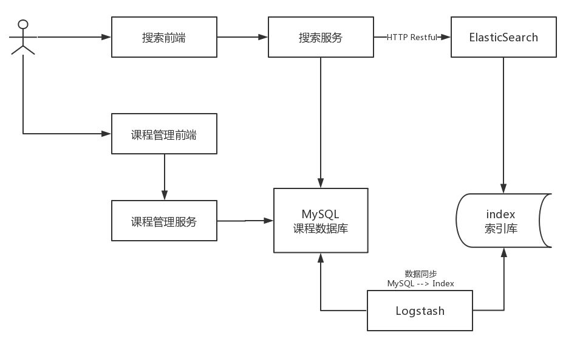
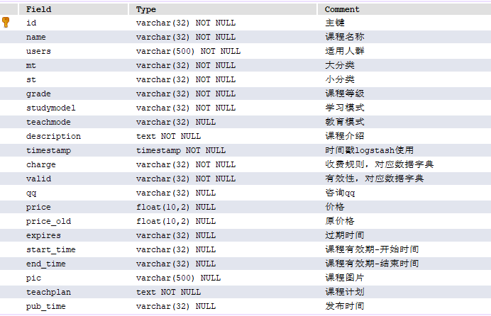

# Day11 搜索服务

## 1. 课程搜索需求分析
### 1.1. 需求分析

1. 根据分类搜索课程信息
2. 根据关键字搜索课程信息，搜索方式为全文检索，关键字需要匹配课程的名称、课程内容
3. 根据难度等级搜索课程
4. 搜索结点分页显示

### 1.2. 搜索流程

1. 课程管理服务将数据写到MySQL数据库
2. 使用Logstash将MySQL数据库中的数据写到ES的索引库。
3. 用户在前端搜索课程信息，请求到搜索服务。
4. 搜索服务请求ES搜索课程信息

## 2. 全文检索技术研究

研究ElasticSearch搜索使用方法

> 参考：\【07】分布式架构 & 微服务架构\【04】Elastic Stack\02-ElasticSearch-分布式全文搜索引擎.md

## 3. 课程索引
### 3.1. 技术方案

如何维护课程索引信息？

1. 当课程向MySQL添加后同时将课程信息添加到索引库。采用Logstach实现，Logstach会从MySQL中将数据采集到ES索引库。
2. 当课程在MySQL更新信息后同时更新该课程在索引库的信息。采用Logstach实现。
3. 当课程在MySQL删除后同时将该课程从索引库删除。手工写程序实现，在删除课程后将索引库中该课程信息删除

### 3.2. 准备课程索引信息

课程发布成功在MySQL数据库存储课程发布信息，此信息作为课程索引信息

#### 3.2.1. 创建课程发布表

课程信息分布在course_base、course_pic等不同的表中。课程发布成功后，为了方便进行索引将这几张表的数据合并在一张表中，作为课程发布信息

创建course_pub表（之前项目资料已提供的此建表sql语句）

#### 3.2.2. 创建课程发布表模型

在xc-framework-model工程，课程管理服务包下创建模型CoursePub

