# 项目核心业务开发

## 1. 开发环境管理后台项目的部署

### 1.1. 项目初始化

【backend】 :  管理后台源码。是maven工程

1. 导入到 IDE。修改相关的配置文件
2. 创建名称为 prize 的数据库（*可修改为其他名称，但需要相应修改工程的连接数据库的相应配置文件*），导入工程 `resources/sql` 目录下的数据库脚本，初始化相关表与数据

### 1.2. 项目启动

使用 maven 命令启动项目即可

```shell
tomcat7:run
```

- 管理后台访问地址：localhost:8888 
- 账号/密码：admin/123456、zcurd/123456

## 2. 部署项目涉及的中间件

在 linux 系统中启动项目所需要的中间件，分别是：Redis、Zookeeper、RabbitMQ、Nginx。此项目所有中间件均使用 docker 进行部署

> 注：以下以均已下载 docker 镜像为前提，再执行的部署脚本，相关的启动脚本的存放位置如下：
>
> - 实战项目 `\prize-event-project\document\scripts\`
> - 测试的linux系统(192.168.12.132) `/usr/local/script`

### 2.1. Redis 启动（port: 6379）

```shell
# 下载镜像
docker pull redis

# 运行容器
docker run -id --name=redis -p 6379:6379 redis
```

### 2.2. Zookeeper（port: 32181）

```shell
# 下载镜像
docker pull zookeeper

# 运行容器
docker run -id --name=zookeeper -v /opt/data/zksingle:/data -p 2181:2181 -e ZOO_LOG4J_PROP="INFO,ROLLINGFILE" zookeeper
```

### 2.3. RabbitMQ（port: 5672、15672）

```shell
# 下载镜像
docker pull rabbitmq

# 运行容器
docker run -d -p 15672:15672  -p 5672:5672  --name rabbitmq --hostname=my-rabbitmq rabbitmq:management
```

### 2.4. Nginx（port: 80）

```shell
# 下载镜像
docker pull nginx

# 运行容器
docker rm -f nginx
docker run --name nginx -v /opt/data/nginx/html:/usr/share/nginx/html:ro -v /opt/app/back/upload:/usr/share/nginx/upload:ro -v /opt/data/nginx/nginx.conf:/etc/nginx/nginx.conf:ro -p 80:80 --privileged=true -d nginx
```

创建容器时可能会报错：

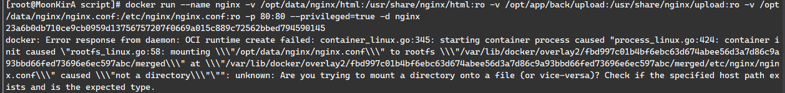

提示 `Check if the specified host path exists and is the expected type`。意思是docker 在挂载时当成目录，所以需要进入挂载的目录，将生成的目录删除（*示例是nginx.conf*），再创建相应名称的文本文件即可

```bash
cd /opt/data/nginx/
rm -rf nginx.conf/
# 创建文件
touch nginx.conf
```

启动 nginx 前，需要修改 `nginx.conf` 配置文件

### 2.5. MySQL（port: 3306）

```shell
# 搜索镜像
docker search mysql
# 拉取镜像
docker pull mysql:5.7
# 创建守护式容器
docker run -id --name=mysql3306 -v /opt/data/mysql:/var/lib/mysql -p3306:3306 -e MYSQL_ROOT_PASSWORD=123456 mysql:5.7.4
# 防火墙中打开3306端口
firewall-cmd --zone=public --add-port=3306/tcp --permanent
```

## 3. 开发环境前台项目的部署

### 3.1. 启动服务注册中心 eureka

- 修改项目配置文件 bootstrap.properties 与 bootstrap-prod.properties，指定 zookeeper 配置中心的地址

```properties
## 配置zookeeper地址
spring.cloud.zookeeper.connect-string=192.168.12.132:2181
```

- 启动 zkui，修改 eureka 地址

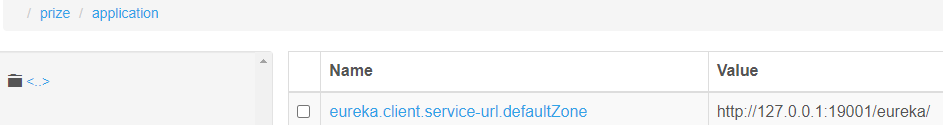

- 运行启动类，配置运行参数，指定端口号与当前环境变量

```
--server.port=19001 --spring.profiles.active=dev
```

### 3.2. 启动 api 模块

- 修改项目配置文件 bootstrap.properties 与 bootstrap-prod.properties，指定 zookeeper 配置中心的地址

```properties
## 配置zookeeper地址
spring.cloud.zookeeper.connect-string=192.168.12.132:2181
```

- 运行启动类，配置运行参数，指定端口号与当前环境变量

```
--server.port=19002 --spring.profiles.active=dev
```

### 3.3. 启动 msg 模块

- 修改项目配置文件 bootstrap.properties 与 bootstrap-prod.properties，指定 zookeeper 配置中心的地址

```properties
## 配置zookeeper地址
spring.cloud.zookeeper.connect-string=192.168.12.132:2181
```

- 运行启动类，配置运行参数，指定端口号与当前环境变量

```
--server.port=19003 --spring.profiles.active=dev
```

### 3.4. 启动定时任务 job 模块

- 修改项目配置文件 bootstrap.properties 与 bootstrap-prod.properties，指定 zookeeper 配置中心的地址

```properties
## 配置zookeeper地址
spring.cloud.zookeeper.connect-string=192.168.12.132:2181
```

- 运行启动类，配置运行参数，指定端口号与当前环境变量

```
--server.port=19003 --spring.profiles.active=dev
```

## 4. 项目功能代码解析

- 项目整体的交互序列图详见[《系统设计 项目交互序列图》](/项目资料/红包雨场景案例-项目资料/02-系统设计?id=_24-项目交互序列图)
- 项目的缓存体系图详见[《系统设计 缓存体系》](/项目资料/红包雨场景案例-项目资料/02-系统设计?id=_25-缓存体系)

### 4.1. 项目 API 功能模块的划分

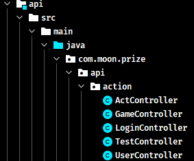

- `ActController`：抽奖模块
- `GameController`：活动模块，包括活动列表、活动详情、查询活动规则、查询中奖信息等
- `LoginController`：登陆模块，包括注册、登陆、退出
- `UserController`：用户模块，用户的个人中心相关业务

### 4.2. 活动预热

活动预热是主要是定时扫描活动表，将距离当前时间还有一分钟（内）开始的所有活动加载，将活动 id 与奖品令牌桶生成映射关系放到 redis 缓存中。

而奖品令牌桶是 list 类型，里面是一个个奖品令牌的字符串。最后创建普通的 k-v 类型的，用于存储奖品令牌与奖品（商品）id 的映射关系。

#### 4.2.1. 定时任务处理逻辑源码分析

在 job 模块中，创建自定义定时任务实现类 `GameTask` 实现 `com.dangdang.ddframe.job.api.simple.SimpleJob` 接口。并标识 `@Component` 与 `@ElasticSimpleJob` 加载到 spring 容器中。在 `execute` 方法中编写活动预热的业务逻辑

```java
/**
 * 活动信息预热，每隔1分钟执行一次
 * 查找未来1分钟内（含1分钟），要开始的活动
 */
@Component
@ElasticSimpleJob(cron = "0 * * * * ?")
public class GameTask implements SimpleJob {
    private final static Logger log = LoggerFactory.getLogger(GameTask.class);
    @Autowired
    private CardGameMapper gameMapper;
    @Autowired
    private CardGameProductMapper gameProductMapper;
    @Autowired
    private CardGameRulesMapper gameRulesMapper;
    @Autowired
    private GameLoadMapper gameLoadMapper;
    @Autowired
    private RedisUtil redisUtil;

    /* 定时任务执行的业务逻辑方法 */
    @Override
    public void execute(ShardingContext shardingContext) {
        // 当前时间
        Date now = new Date();
        // 查询将来1分钟内要开始的活动 CardGameExample 是代码生成器生成的查询条件对象
        CardGameExample example = new CardGameExample();
        CardGameExample.Criteria criteria = example.createCriteria();
        // 开始时间大于当前时间
        criteria.andStarttimeGreaterThan(now);
        // 小于等于（当前时间+1分钟）
        criteria.andStarttimeLessThanOrEqualTo(DateUtils.addMinutes(now, 1));
        // 获取到符合要求的活动列表（在1分钟内开始）
        List<CardGame> list = gameMapper.selectByExample(example);
        if (list.size() == 0) {
            // 没有查到要开始的活动
            log.info("game list scan : size = 0");
            return;
        }
        log.info("game list scan : size = {}", list.size());
        // 有相关活动数据，则将活动数据预热，进redis
        list.forEach(game -> {
            // 活动开始时间
            long start = game.getStarttime().getTime();
            // 活动结束时间
            long end = game.getEndtime().getTime();
            // 计算活动结束时间到现在还有多少秒，作为redis key过期时间
            long expire = (end - now.getTime()) / 1000;
            // long expire = -1; //永不过期
            // 活动持续时间（ms）
            long duration = end - start;

            // 设置活动的状态，1-已加载
            game.setStatus(1);
            // 前缀+活动id 作为 key，value 是活动实例
            redisUtil.set(RedisKeys.INFO + game.getId(), game, -1);
            // 记录日志，已加载那些活动
            log.info("load game info:{},{},{},{}", game.getId(), game.getTitle(), game.getStarttime(), game.getEndtime());

            // 活动奖品信息
            List<CardProductDto> products = gameLoadMapper.getByGameId(game.getId());
            Map<Integer, CardProduct> productMap = new HashMap<>(products.size());
            // 建立商品id与商品实例的映射关系
            products.forEach(p -> productMap.put(p.getId(), p));
            log.info("load product type:{}", productMap.size());

            // 奖品数量等配置信息
            CardGameProductExample productExample = new CardGameProductExample();
            productExample.createCriteria().andGameidEqualTo(game.getId());
            // 查询活动与奖品关系表
            List<CardGameProduct> gameProducts = gameProductMapper.selectByExample(productExample);
            log.info("load bind product:{}", gameProducts.size());

            // 令牌桶（队列类型）
            List<Long> tokenList = new ArrayList<>();
            gameProducts.forEach(cgp -> {
                // 生成 amount 个 start 到 end 之间的随机时间戳做令牌
                for (int i = 0; i < cgp.getAmount(); i++) {
                    long rnd = start + new Random().nextInt((int) duration);
                    /*
                     * 乘1000，再额外加一个随机数，是防止时间段奖品多时重复
                     * 记得取令牌判断时间时，除以1000，还原真正的时间戳
                     */
                    long token = rnd * 1000 + new Random().nextInt(999);
                    // 将令牌放入令牌桶
                    tokenList.add(token);
                    // 以令牌做 key，对应的商品为 value，创建 redis 缓存
                    log.info("token -> game : {} -> {}", token / 1000, productMap.get(cgp.getProductid()).getName());
                    // 活动id+令牌token 作为 key，与实际奖品之间建立映射关系，并设置key在活动结束时过期
                    redisUtil.set(RedisKeys.TOKEN + game.getId() + "_" + token, productMap.get(cgp.getProductid()), expire);
                }
            });
            // 排序后放入 redis 队列
            Collections.sort(tokenList);
            log.info("load tokens:{}", tokenList);

            // 从右侧压入队列，从左到右，时间戳逐个增大
            redisUtil.rightPushAll(RedisKeys.TOKENS + game.getId(), tokenList);
            // 设置令牌桶 key 的过期时间
            redisUtil.expire(RedisKeys.TOKENS + game.getId(), expire);

            // 奖品策略配置信息
            CardGameRulesExample rulesExample = new CardGameRulesExample();
            rulesExample.createCriteria().andGameidEqualTo(game.getId());
            List<CardGameRules> rules = gameRulesMapper.selectByExample(rulesExample);
            // 遍历策略，存入 redis hset
            rules.forEach(r -> {
                redisUtil.hset(RedisKeys.MAXGOAL + game.getId(), r.getUserlevel() + "", r.getGoalTimes());
                redisUtil.hset(RedisKeys.MAXENTER + game.getId(), r.getUserlevel() + "", r.getEnterTimes());
                log.info("load rules:level={},enter={},goal={}", r.getUserlevel(), r.getEnterTimes(), r.getGoalTimes());
            });
            // 设置最大中奖次数与最大抽奖次数的 key 的过期时间
            redisUtil.expire(RedisKeys.MAXGOAL + game.getId(), expire);
            redisUtil.expire(RedisKeys.MAXENTER + game.getId(), expire);

            // 活动状态变更为已预热，禁止管理后台再随便变动
            game.setStatus(1);
            gameMapper.updateByPrimaryKey(game);
        });
    }
}
```

具体的逻辑要求分析：

- 定义任务的 cron 表达式 `cron = "0 * * * * ?"`，此任务是每分钟准点（0秒）时执行，查找未来1分钟内（含1分钟），要开始的活动。
- 循环活动计算活动的结束时间与持续时间，在缓存中保存活动id与活动实例的映射关系
- 根据活动id查询相应的奖品（商品），创建map集合存放奖品id与奖品实例的映射
- 查询当前活动与奖品的关系表，获取奖品的数量
- 循环所有奖品，根据奖品的数量生成相应数量的令牌（时间戳），排序后放到 List 类型的缓存中
- 查询奖品策略规则，循环放到hash类型的缓存中
- 最后更新活动表相应的活动状态为已加载

**过期时间**：活动结束时间 - 当前时间 = 有效时长， 活动结束则缓存自动失效

**调度策略**：每隔1分钟扫描一遍活动表，查询未来1分钟内要开始的活动进行预热。

#### 4.2.2. 测试

启动后台管理系统，访问地址：`http://localhost:8888/`，在活动配置中新增即将开始的活动、设置奖品配置、策略配置

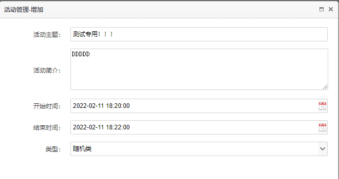

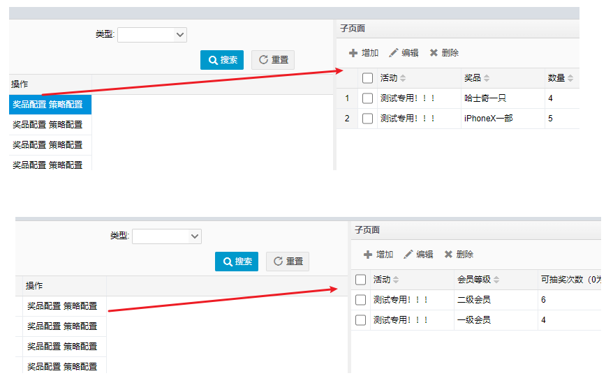

启动前台系统（eureka、job 工程），观察 job 工程的控制台输入日志

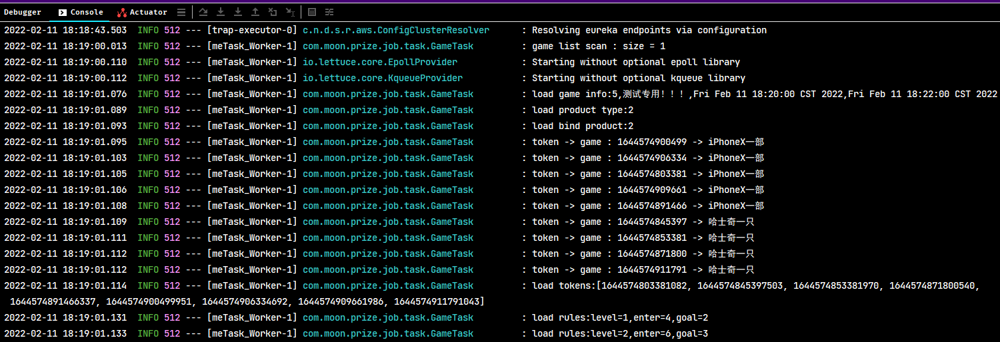

### 4.3. 抽奖业务

此部分的业务逻辑代码在 api 工程的  `ActController#act` 方法中。此模块使用了 Swagger2 接口文档框架，启动服务后，可以访问此网址 `http://localhost:19002/doc.html`，查看接口相关的信息：

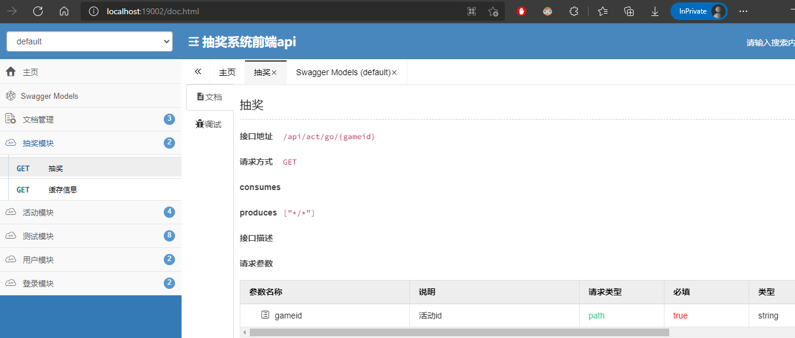

#### 4.3.1. 业务逻辑源码分析

```java
@RestController
@RequestMapping("/api/act")
@Api(tags = {"抽奖模块"})
public class ActController {

    @Autowired
    private RedisUtil redisUtil;
    @Autowired
    private RabbitTemplate rabbitTemplate;
    @Autowired
    private LuaScript luaScript;

    @GetMapping("/go/{gameid}")
    @ApiOperation(value = "抽奖")
    @ApiImplicitParams({
            @ApiImplicitParam(name = "gameid", value = "活动id", example = "1", required = true)
    })
    public ApiResult<Object> act(@PathVariable int gameid, HttpServletRequest request) {
        Date now = new Date();
        // 从 redis 中获取活动基本信息
        CardGame game = (CardGame) redisUtil.get(RedisKeys.INFO + gameid);
        /*
         * 判断活动是否开始
         *  1. 如果活动信息还没加载进 redis，视为无效
         *  2. 如果活动已经加载预热完成，即 redis 中存在，但是开始时间大于当前时间，也视为无效
         * 均返回提示信息
         */
        if (game == null || game.getStarttime().after(now)) {
            return new ApiResult<>(-1, "活动未开始", null);
        }
        // 判断活动是否已结束
        if (now.after(game.getEndtime())) {
            return new ApiResult<>(-1, "活动已结束", null);
        }
        // 获取当前用户信息
        HttpSession session = request.getSession();
        CardUser user = (CardUser) redisUtil.get(RedisKeys.SESSIONID + session.getId());
        // 判断用户是否登陆
        if (user == null) {
            return new ApiResult<>(-1, "未登陆", null);
        }

        // 判断用户是否已经参加过活动。主要是让第一次点击进来的用户，更新数据库表，记录该用户参与过活动
        if (!redisUtil.hasKey(RedisKeys.USERGAME + user.getId() + "_" + gameid)) {
            // 如第一次抽奖，则向 redis 记录当前用户，存储的 key 为 id_gameid
            redisUtil.set(RedisKeys.USERGAME + user.getId() + "_" + gameid, 1, (game.getEndtime().getTime() - now.getTime()) / 1000);
            // 持久化抽奖记录，扔给消息队列处理
            CardUserGame userGame = new CardUserGame();
            userGame.setUserid(user.getId());
            userGame.setGameid(gameid);
            userGame.setCreatetime(new Date());
            // 发送消息队列，异步记录用户参与活动的数据
            rabbitTemplate.convertAndSend(RabbitKeys.QUEUE_PLAY, userGame);
        }

        // 从 redis 中获取用户已中奖次数
        Integer count = (Integer) redisUtil.get(RedisKeys.USERHIT + gameid + "_" + user.getId());
        if (count == null) {
            count = 0;
            // 第一次进来的，初始用户已中奖次数为0
            redisUtil.set(RedisKeys.USERHIT + gameid + "_" + user.getId(), count, (game.getEndtime().getTime() - now.getTime()) / 1000);
        }
        // 根据会员等级，获取本活动允许的最大中奖数
        Integer maxcount = (Integer) redisUtil.hget(RedisKeys.MAXGOAL + gameid, user.getLevel() + "");
        // 如果没设置，默认为0，即：不限制次数
        maxcount = maxcount == null ? 0 : maxcount;
        // 限制中奖次数与用户已中奖次数进行对比
        if (maxcount > 0 && count >= maxcount) {
            // 如果达到最大次数，不允许抽奖
            return new ApiResult<>(-1, "您已达到最大中奖数", null);
        }

        /* ===== 以上校验全部通过，准许进入抽奖逻辑 ===== */

        /* 使用java方式实现从redis中获取令牌，此方式会存在并发问题 */
        // Long token = (Long) redisUtil.leftPop(RedisKeys.TOKENS + gameid);
        // if (token == null) {
        //     // 令牌为空，说明奖品已抽完了
        //     return new ApiResult<>(-1, "奖品已抽光", null);
        // }
        // /*
        //  * 判断令牌时间戳大小，即是否中奖
        //  *  特别注意，取出的令牌要除以1000，都真正的时间戳，参考job项目，令牌生成部分逻辑
        //  */
        // if (now.getTime() < token / 1000) {
        //     // 当前时间小于令牌时间戳，说明奖品未到发放时间点，放回令牌，返回未中奖
        //     redisUtil.leftPush(RedisKeys.TOKENS + gameid, token);
        //     return new ApiResult<>(0, "未中奖", null);
        // }

        /* 代码改造 解决并发问题，使用lua脚本方式来获取令牌，保证操作的原子性 */
        Long token = luaScript.tokenCheck(RedisKeys.TOKENS + gameid, String.valueOf(now.getTime()));
        if (token == 0) {
            return new ApiResult<>(-1, "奖品已抽光", null);
        } else if (token == 1) {
            return new ApiResult<>(0, "未中奖", null);
        }

        // 以上逻辑走完，说明很幸运，中奖了！
        // 根据 活动id+时间戳 从缓存中查询抽中的奖品：
        CardProduct product = (CardProduct) redisUtil.get(RedisKeys.TOKEN + gameid + "_" + token);
        // 更新当前用户的中奖次数，加1
        redisUtil.incr(RedisKeys.USERHIT + gameid + "_" + user.getId(), 1);
        // 投放消息给队列，中奖后的耗时业务，交给消息模块处理
        CardUserHit hit = new CardUserHit();
        hit.setGameid(gameid);
        hit.setHittime(now);
        hit.setProductid(product.getId());
        hit.setUserid(user.getId());
        rabbitTemplate.convertAndSend(RabbitKeys.EXCHANGE_DIRECT, RabbitKeys.QUEUE_HIT, hit);

        // 返回给前台中奖信息
        return new ApiResult<>(1, "恭喜中奖", product);
    }
}
```

具体的逻辑要求分析：

- 请求url是 `/api/act/go/{gameid}`，从请求url中获取活动的id
- 根据活动id 从 redis 中查询相应的活动，先进行活动是否有效的校验，以下情况均判断为无效。
    - 缓存无此数据
    - 缓存存在但活动的开始时间大于大于当前时间
    - 缓存存在但当前时间大于活动结束时间
- 从缓存redis中获取当前用户，校验是否已登陆
- 根据用户id+活动id，判断缓存中是否存在该key，如果不存在，说明用户是第一次点击进来参加活动，这里会先往缓存以 `用户id+活动id` 作为key新增一个记录，然后再发送消息，异步更新用户活动表，记录用户参与过的活动
- 从缓存中获取用户已中奖次数，与活动所设置的最大中奖数比对，判断是否已经超过最大中奖的数量
- 经过前面的校验后，进入抽奖的逻辑（即从缓存中获取令牌），如果获取不到令牌或者令牌的时间小于当前时间（需要将令牌放回缓存，这里使用java实现会存在并发问题），即无效（未中奖）。*值得注意：这里的令牌需要除以1000才是真实的时间戳*
- 最后就是中奖后的业务逻辑，根据时间戳从缓存中查询相应的奖品信息，先将缓存中该用户的中奖次数+1，再发送消息异步记录用户的中奖信息到数据库表中

#### 4.3.2. 并发问题处理方案

解决并发问题的核心就将从缓存中获取令牌与放回令牌变成原子操作即可，这里通过 lua 脚本来实现：

```lua
-- local token 定义变量
-- redis.call('lpop',KEYS[1]) 调用redis 命令，从队列左侧获取一个元素
-- 注意 lua 语法中的数组第一个元素的索引是 1，而不是0
local token = redis.call('lpop',KEYS[1])
-- 获取第二个元素
local curtime = tonumber(KEYS[2])

-- 判断是否有效
if token ~= false then
    -- 数据比对，当前时间与令牌中的时间戳比较
    if ( tonumber(token)/1000 > tonumber(KEYS[2]) ) then
       redis.call('lpush',KEYS[1],token)
       return 1
    else
       -- 成功，将令牌返回
       return tonumber(token)
    end
else
    return 0
end
```

创建读取与使用 lua 脚本的处理类

```java
@Service
public class LuaScript {

    @Autowired
    private RedisTemplate redisTemplate;

    private DefaultRedisScript<Long> script;

    @PostConstruct
    public void init() {
        script = new DefaultRedisScript<>();
        script.setResultType(Long.class);
        script.setScriptSource(new ResourceScriptSource(new ClassPathResource("lua/tokenCheck.lua")));
    }

    public Long tokenCheck(String gamekey, String curtime) {

        List<String> keys = new ArrayList();
        keys.add(gamekey);
        keys.add(curtime);

        Long result = (Long) redisTemplate.execute(script, keys, 0, 0);

        return result;
    }
}
```

在原来的 java 代码中进行调用：

```java
@Autowired
private LuaScript luaScript;

Long token = luaScript.tokenCheck("game_" + gameid, String.valueOf(new Date().getTime()));
```

### 4.4. 中奖后续处理

中奖后续处理是指，在用户抽奖的过程中，发送了两次异步消息到消息中间件，分别实现记录用户参加此活动（代码逻辑会控制第一次参加时，只发送一次）、记录用户的中奖信息。这部分业务是由 msg 内容模块来实现

#### 4.4.1. RabbitMQ 配置

因为消息有发送方和消息方同样都需要配置，所以 RabbitMQ 配置类是放到 commons 模块中

```java
@Configuration
public class RabbitConfig {
    private static Logger log = LoggerFactory.getLogger(RabbitConfig.class);
    @Autowired
    private CachingConnectionFactory connectionFactory;

    @Bean
    public Queue getQueueHit() {
        return new Queue(com.moon.prize.commons.config.RabbitKeys.QUEUE_HIT);
    }

    @Bean
    public Queue getQueuePlay() {
        return new Queue(com.moon.prize.commons.config.RabbitKeys.QUEUE_PLAY);
    }

    /**
     * exchange
     */
    @Bean
    DirectExchange directExchange() {
        return new DirectExchange(com.moon.prize.commons.config.RabbitKeys.EXCHANGE_DIRECT);
    }

    // 绑定队列于路由
    @Bean
    Binding bindingExchangeDirect() {
        return BindingBuilder.bind(getQueueHit()).to(directExchange()).with(com.moon.prize.commons.config.RabbitKeys.QUEUE_HIT);
    }

    @Bean
    Binding bindingExchangeDirect2() {
        return BindingBuilder.bind(getQueuePlay()).to(directExchange()).with(com.moon.prize.commons.config.RabbitKeys.QUEUE_PLAY);
    }

    @Bean
    public RabbitTemplate rabbitTemplate() {
        /*
         * 若使用confirm-callback或return-callback，必须要配置publisherConfirms或publisherReturns为true
         * 每个rabbitTemplate只能有一个confirm-callback和return-callback，如果这里配置了，那么写生产者的时候不能再写confirm-callback和return-callback
         * 使用return-callback时必须设置mandatory为true，或者在配置中设置mandatory-expression的值为true
         */
        connectionFactory.setPublisherConfirms(true);
        connectionFactory.setPublisherReturns(true);
        RabbitTemplate rabbitTemplate = new RabbitTemplate(connectionFactory);
        rabbitTemplate.setMandatory(true);
        /*
         * 如果消息没有到exchange,则confirm回调,ack=false
         * 如果消息到达exchange,则confirm回调,ack=true
         * exchange到queue成功,则不回调return
         * exchange到queue失败,则回调return(需设置mandatory=true,否则不回回调,消息就丢了)
         */
        rabbitTemplate.setConfirmCallback(new RabbitTemplate.ConfirmCallback() {
            @Override
            public void confirm(CorrelationData correlationData, boolean ack, String cause) {
                if (ack) {
                    log.info("消息发送成功:correlationData({}),ack({}),cause({})", correlationData, ack, cause);
                } else {
                    log.info("消息发送失败:correlationData({}),ack({}),cause({})", correlationData, ack, cause);
                }
            }
        });
        rabbitTemplate.setReturnCallback(new RabbitTemplate.ReturnCallback() {
            @Override
            public void returnedMessage(Message message, int replyCode, String replyText, String exchange, String routingKey) {
                log.info("消息丢失:exchange({}),route({}),replyCode({}),replyText({}),message:{}", exchange, routingKey, replyCode, replyText, message);
            }
        });
        return rabbitTemplate;
    }
}
```

#### 4.4.2. 异步消息的消费处理

抽奖的主流程中，中奖后，会将中奖信息放入消息队列，然后立刻返回结果响应前台。msg 模块分别定义两个消费者来分别处理记录用户参与活动与用户中奖信息

- 处理用户参与活动，监听 `prize_queue_play` 的队列

```java
@Component
// @RabbitListener 注解指定监听的队列
@RabbitListener(queues = RabbitKeys.QUEUE_PLAY)
public class PrizeGameReceiver {

    private final static Logger logger = LoggerFactory.getLogger(PrizeGameReceiver.class);

    @Autowired
    private CardUserGameMapper cardUserGameMapper;

    @RabbitHandler
    public void processMessage3(CardUserGame message) {
        logger.info("user play : game={},user={},time={} ", message.getGameid(), message.getUserid(), message.getCreatetime());
        // 持久化用户中奖活动的信息到数据库表
        cardUserGameMapper.insert(message);
    }
}
```

- 处理用户中奖信息，监听 `prize_queue_hit` 的队列

```java
@Component
@RabbitListener(queues = RabbitKeys.QUEUE_HIT)
public class PrizeHitReceiver {
    private final static Logger logger = LoggerFactory.getLogger(PrizeHitReceiver.class);

    @Autowired
    private CardUserHitMapper hitMapper;

    // 多个 @RabbitHandler 注解标识的方法，会根据发送的类型来选择执行那个方法
    @RabbitHandler
    public void processMessage3(Map<String, String> message) {
        logger.info("user hit : " + message);
        CardUserHit hit = new CardUserHit();
        hit.setGameid(MapUtils.getIntValue(message, "gameid"));
        hit.setUserid(MapUtils.getIntValue(message, "userid"));
        hit.setProductid(MapUtils.getIntValue(message, "productid"));
        hit.setHittime(new Date(MapUtils.getLongValue(message, "hittime")));
        hitMapper.insert(hit);
    }
}
```

### 4.5. 缓存监控

缓存监控是指，在 api 模块中，编写一个接口，用于方便去查询当前指定的令牌桶中的数据

在 `ActController` 类中定义一个请求方法，请求 url 是 `/api/act/info/{gameid}`

```java
@GetMapping("/info/{gameid}")
@ApiOperation(value = "缓存信息")
@ApiImplicitParams({
        @ApiImplicitParam(name = "gameid", value = "活动id", example = "1", required = true)
})
public ApiResult<Object> info(@PathVariable int gameid) {
    Map<String, Object> map = new LinkedHashMap<>();
    map.put(RedisKeys.INFO + gameid, redisUtil.get(RedisKeys.INFO + gameid));
    List<Object> tokens = redisUtil.lrange(RedisKeys.TOKENS + gameid, 0, -1);
    Map<String, Object> tokenMap = new LinkedHashMap<>();
    tokens.forEach(o -> tokenMap.put(
            new SimpleDateFormat("yyyy-MM-dd HH:mm:ss.SSS").format(new Date(Long.parseLong(o.toString()) / 1000)),
            redisUtil.get(RedisKeys.TOKEN + gameid + "_" + o))
    );
    map.put(RedisKeys.TOKENS + gameid, tokenMap);
    map.put(RedisKeys.MAXGOAL + gameid, redisUtil.hmget(RedisKeys.MAXGOAL + gameid));
    map.put(RedisKeys.MAXENTER + gameid, redisUtil.hmget(RedisKeys.MAXENTER + gameid));
    return new ApiResult<>(200, "缓存信息", map);
}
```

通过 Swagger 或者 postman 请求后，返回结果如下：

```json
{
    "code": 200,
    "msg": "缓存信息",
    "data": {
        "game_info_5": {
            "id": 5,
            "title": "财务自由就靠这了",
            "info": "财务自由就靠这了财务自由就靠这了财务自由就靠这了财务自由就靠这了财务自由就靠这了财务自由\n就靠这了财务自由就靠这了财务自由就靠这了财务自由就靠这了",
            "starttime": "2019‐10‐08 10:21:46",
            "endtime": "2019‐10‐08 16:43:46",
            "type": 2,
            "status": 1
        },
        "game_tokens_5": {
            "2019‐10‐08 10:34:07.662": {
                "id": 8,
                "name": "不长胖奶茶一杯",
                "pic": "/upload/images/QQ图片20190903143639.jpg",
                "info": "奶茶原为中国北方游牧民族的日常饮品，至今最少已有千年历史。自元朝起传遍世界各地，目前在大中华地区，中亚国家，印度，阿拉伯，英国，马来西亚，新加坡等地区都有不同种类奶茶流行。蒙古高原和中亚地区的奶茶千百年来从未改变，至今仍然是日常饮用及待客的必备饮料。",
                "price": 50
            },
            "2019‐10‐08 10:39:23.571": {
                "id": 5,
                "name": "美国商务办公室一套",
                "pic": "/upload/images/123d.jpg",
                "info": "白宫（英语：The White House）也称为白屋，是美国总统的官邸和办公室。1902年被西奥多∙罗斯福总统正式命名为“白宫”。白宫由美国国家公园管理局拥有",
                "price": 1000
            },
            "2019‐10‐08 10:41:51.542": {
                "id": 8,
                "name": "不长胖奶茶一杯",
                "pic": "/upload/images/QQ图片20190903143639.jpg",
                "info": "奶茶原为中国北方游牧民族的日常饮品，至今最少已有千年历史。自元朝起传遍世界各地，目前在大中华地区，中亚国家，印度，阿拉伯，英国，马来西亚，新加坡等地区都有不同种类奶茶流行。蒙古高原和中亚地区的奶茶千百年来从未改变，至今仍然是日常饮用及待客的必备饮料。",
                "price": 50
            },
            "2019‐10‐08 10:46:43.439": {
                "id": 1,
                "name": "iPhoneX一部",
                "pic": "/upload/images/aaa123.JPEG",
                "info": "iPhone X是美国Apple（苹果公司）于北京时间2017年9月13日凌晨1点，在Apple Park新总部的史蒂夫∙乔布斯剧院会上发布的新机型。其中“X”是罗马数字“10”的意思，代表着苹果向iPhone问世十周年致敬。",
                "price": 5000
            },
            "2019‐10‐08 10:52:53.002": {
                "id": 6,
                "name": "地下车位一个",
                "pic": "/upload/images/asdasd2.jpg",
                "info": "地库设计导则 ‐ 说明 ? 本指引针对的项目类型仅为区域内GCT主流项目。 ? 本指引是在广深区域目前操作项目的前提下,根据各项目经验梳理出的小结.",
                "price": 500
            },
            ....
        },
        "game_maxgoal_5": {
            "0": 1,
            "1": 2,
            "2": 3,
            "3": 4,
            "4": 0
        },
        "game_maxenter_5": {
            "0": 0,
            "1": 0,
            "2": 0,
            "3": 0,
            "4": 0
        }
    }
}
```

### 4.6. 登陆模块

用户的登陆处理接口在 api 项目中的 `LoginController` 中，类中只有两个接口，分别是用户登陆与用户退出

#### 4.6.1. 登陆与退出

- **用户登陆接口逻辑**：先从缓存中获取用户登陆错误的次数，如果超过5次，中断并提示用户已经超出次数需等待5分钟。如果用户未超出错误次数，则每一次都往redis缓存中用户id的键自增一次记录；如果用户成功登陆，分别保存用户 id 到 session 与缓存中
- **用户登出接口逻辑**：从session中获取用户id，删除缓存与session

#### 4.6.2. 请求登陆校验拦截器

通过拦截器的方式来实现请求时是否登陆的校验。

- 创建拦截器 `RedisSessionInterceptor`，需要实现 `org.springframework.web.servlet.HandlerInterceptor` 接口，重写 `preHandle` 方法，在请求前进行拦截校验

```java
public class RedisSessionInterceptor implements HandlerInterceptor {
    @Autowired
    private RedisUtil redisUtil;

    // 在请求前进行校验
    @Override
    public boolean preHandle(HttpServletRequest request, HttpServletResponse response, Object handler) throws Exception {
        // 无论访问的地址是不是正确的，都进行登录验证，登录成功后的访问再进行分发，404的访问自然会进入到错误控制器中
        HttpSession session = request.getSession();
        if (session.getAttribute("loginUserId") != null) {
            try {
                // 验证当前请求的session是否是已登录的session
                String loginSessionId = (String) redisUtil.get("loginUser:" + session.getAttribute("loginUserId"));
                if (loginSessionId != null && loginSessionId.equals(session.getId())) {
                    return true;
                }
            } catch (Exception e) {
                e.printStackTrace();
            }
        }

        response401(response);
        return false;
    }

    private void response401(HttpServletResponse response) {
        response.setCharacterEncoding("UTF-8");
        response.setContentType("application/json; charset=utf-8");

        try {
            response.getWriter().print(JSON.toJSONString(new ApiResult<>(-1, "用户未登录！", null)));
        } catch (IOException e) {
            e.printStackTrace();
        }
    }

    @Override
    public void postHandle(HttpServletRequest request, HttpServletResponse response, Object handler, ModelAndView modelAndView) throws Exception {
    }

    @Override
    public void afterCompletion(HttpServletRequest request, HttpServletResponse response, Object handler, Exception ex) throws Exception {
    }
}
```

- 创建配置类 `WebSecurityConfig`，主要配置拦截器加入到spring容器，与配置拦截规则

```java
@Configuration
public class WebSecurityConfig extends WebMvcConfigurerAdapter {
    // 创建自定义拦截器并加入容器
    @Bean
    public RedisSessionInterceptor getSessionInterceptor() {
        return new RedisSessionInterceptor();
    }

    @Override
    public void addInterceptors(InterceptorRegistry registry) {
        /*
         * 所有已api开头的访问都要进入 RedisSessionInterceptor 拦截器进行登录验证，并排除login接口(全路径)。必须写成链式，分别设置的话会创建多个拦截器。
         * 必须写成 getSessionInterceptor()，否则 SessionInterceptor 中的 @Autowired 会无效
         */
        registry.addInterceptor(getSessionInterceptor())
                .addPathPatterns("/api/act/**")
                .addPathPatterns("/api/user/**");
        super.addInterceptors(registry);
    }
}
```

### 4.7. 活动模块

活动模块的处理接口在 api 项目中的 `GameController` 中，主要有活动列表、奖品信息、活动信息、中奖列表等查询功能。

> *功能都相对简单，具体查看项目源码*

### 4.8. 用户模块

用户模块的处理接口在 api 项目中的 `UserController` 中，主要有用户信息、我的奖品等查询功能。

> *功能都相对简单，具体查看项目源码*

## 5. 项目启动业务测试

经过上面的解析后，可以根据以下步骤去测试

- 启动中间件：mysql，redis，rabbitmq，zookeeper
- 启动 Eureka、job、msg、api 工程（Eureka 注册最先启动，其余的顺序无关系）
- 启动管理后台，创建活动
- 查看 job 日志，是否在开始前的1分钟，将活动预热成功
- 请求抽奖接口，查看是否提示活动未开始
- 开始时间后，请求抽奖接口，调试api，看是否可以正常抽奖
- 中奖后，看msg日志，是否有中奖消息发送到消息模块
- 查看数据库，确认中奖信息是否正常写入db

# 项目上线部署

## 1. 项目部署拓扑图

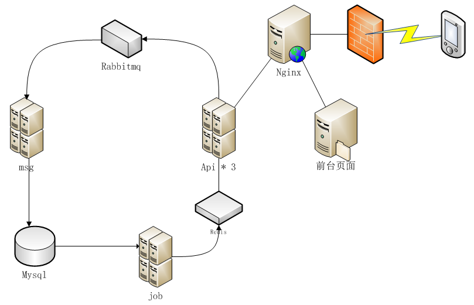

## 2. jenkins 部署

Jenkins 是一款流行的开源持续集成（Continuous Integration）工具，广泛用于项目开发，具有自动化构建、测试和部署等功能。

> 官网： http://jenkins-ci.org/

详细内容见 [Jenkins 学习笔记](/DevOps/持续集成工具/Jenkins)

### 2.1. 持续集成环境-Jenkins安装

Jenkins 的安装有多种方式，Jenkins 以 WAR 文件、原生包/安装程序和 Docker 镜像分发。本案例项目使用安装包方式安装

> 注：Jenkins需要依赖JDK，所以测试的系统需要先安装JDK1.8+。

```shell
yum install java-1.8.0-openjdk* -y
# 安装目录是：/usr/lib/jvm
```

获取 jenkins 安装包：https://jenkins.io/zh/download/

安装文件：jenkins-2.190.3-1.1.noarch.rpm

jenkins 安装脚本如下：

```shell
# 把安装包上传到192.168.12.132服务器
rz
# 安装
rpm -ivh jenkins-2.190.3-1.1.noarch.rpm
```

- 修改Jenkins配置

```bash
vi /etc/syscofig/jenkins
```

修改内容如下：

```
JENKINS_USER="root"
JENKINS_PORT="8888"
```

- 启动Jenkins

```bash
systemctl start jenkins
```

- 浏览器访问：http://192.168.12.132:8888

### 2.2. 任务汇总

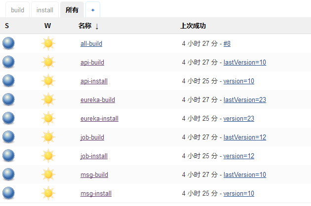

说明：以 eureka 为例，每个服务都分为两个阶段：build，install 两个任务

- build 即编译阶段，从 git 获取代码，maven 打包出 springboot-jar，启用 docker 打成镜像，并以当前 build_num 为版本号。
- install 即部署阶段，将上一步中打出的镜像，通过 docker swarm 部署启动。

### 2.3. 部署脚本

#### 2.3.1. 项目编译任务

此任务主要是将项目从git拉取下来后，编译，再打成 docker 镜像

build.sh 内容如下：

```shell
app=$1
mv /opt/app/$app/ROOT.jar /opt/app/$app/`date +"%Y%m%d-%H%M%S"`.jar
cp frontend/$app/target/$app-0.0.1-SNAPSHOT.jar /opt/app/$app/ROOT.jar
cat /opt/app/Dockerfile > /opt/app/$app/Dockerfile
docker build -t $app:$BUILD_NUMBER /opt/app/$app
```

在 jenkins 中使用的命令如下：

```bash
/opt/scripts/build.sh 服务名
```

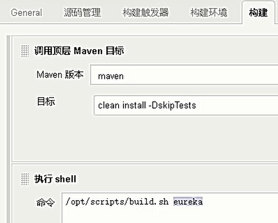

#### 2.3.2. Dockerfile 

jenkins 脚本 build 阶段需要的基础镜像及模板。springboot 微服务镜像全部采用该模板打包生成

```shell
FROM daocloud.io/library/java:openjdk‐8u40‐jdk
# 语言字符，解决乱码问题
ENV LC_ALL C.UTF‐8
ENV LANG C.UTF‐8
ENV LANGUAGE C.UTF‐8
# 时区及时间，不设置会影响活动的开始结束
ENV TZ=Asia/Shanghai
RUN ln ‐snf /usr/share/zoneinfo/$TZ /etc/localtime && echo $TZ > /etc/timezone
# 将springboot的jar包打入镜像
COPY ROOT.jar /opt/ROOT.jar
WORKDIR /opt
# 启动命令，注意环境配置 prod
CMD ["java", "‐jar", "ROOT.jar", "‐‐spring.profiles.active=prod"]
```

#### 2.3.3. 项目构建任务

此任务主要运行镜像，部署项目

install.sh 脚本内容如下：

```shll
app=$1
version=$2
port=$3

docker service rm $app
docker service create --name $app -p $port:8080 --hostname localhost $app:$version
```

在 jenkins 中使用的命令如下：

```bash
/opt/scripts/install.sh 服务名 版本号 端口号
```

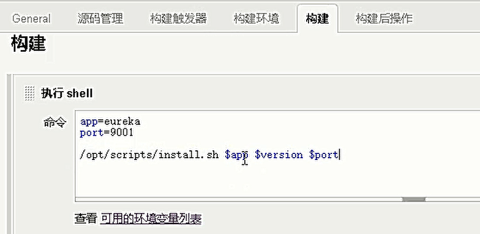

## 3. 中间件部署

zookeeper，redis，mysql，nginx 均采用docker方式部署

```shell
#获取镜像
docker pull zookeeper:3.4.13
docker pull daocloud.io/library/redis:latest
docker pull daocloud.io/library/rabbitmq:3.6.10‐management
docker pull daocloud.io/mysql:5.7.4
docker pull daocloud.io/library/nginx:1.16.0‐alpine‐perl

# 启动镜像
docker run ‐‐name redis ‐p 6379:6379 ‐d daocloud.io/library/redis

docker run ‐‐name mysql ‐v /opt/data/mysql:/var/lib/mysql ‐p3306:3306 ‐e MYSQL_ROOT_PASSWORD=root ‐d daocloud.io/mysql:5.7.4

docker run ‐d ‐‐hostname my‐rabbit ‐‐name rabbit ‐p 15672:15672 ‐p 5672:5672 daocloud.io/library/rabbitmq:3.6.10‐management

docker run ‐‐name nginx ‐v /opt/data/nginx/html:/usr/share/nginx/html:ro ‐v /opt/app/back/upload:/usr/share/nginx/upload:ro ‐v /opt/data/nginx/nginx.conf:/etc/nginx/nginx.conf:ro ‐p 80:80 ‐d daocloud.io/nginx

docker run ‐‐name zookeeper ‐v /opt/data/zksingle:/data ‐p 2181:2181 ‐e ZOO_LOG4J_PROP="INFO,ROLLINGFILE" ‐d zookeeper:3.4.13
```

## 4. 弹性扩容

采用微服务架构就是实现服务单元的快速独立扩容，借助 docker-swarm 的功能，变得很容易实现。以本项目为例，api 模块在部署完成后，会自动扩容到 3 个实例，以负载前端的并发请求：

```bash
docker service scale api=3
```

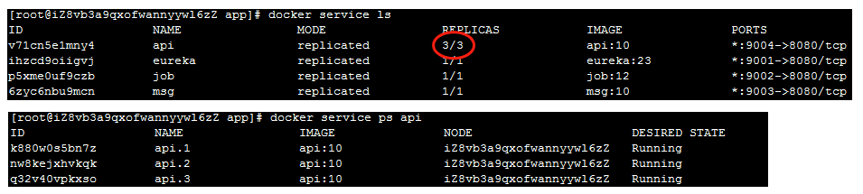

## 5. 管理后台部署

因为是开发平台，打出的 war 包，这里使用 jetty 启动即可

```bash
java -jar /opt/app/jetty-runner.jar --port 7070 /opt/app/back/
```

## 6. 静态页面与nginx

/api 的请求代理到微服务api模块，其他静态文件由 nginx 本地访问，配置如下：

```
worker_processes  3;
events {
        worker_connections  1024;
}
http {

    include       mime.types;
    default_type  application/octet-stream;
    sendfile        on;
    keepalive_timeout  65;
    server {
        listen       80;
        server_name  localhost;
        location ^~ /api/ {
                proxy_pass http://172.17.0.1:9004;
        }
	location ^~ /upload/ {
                alias /usr/share/nginx/upload/;
        }
        location / {
                root /usr/share/nginx/html;
        }
    }
}
```

文件夹 h5 是前端静态页面，最终部署的目录在 /opt/data/nginx/html

# 项目扩展

1. lua脚本的运用

使用lua脚本，将抽奖的逻辑从java端移入redis服务器端，作为一个整体函数暴露给java调用，减少了java服务器与redis服务器之间的通信次数，性能会得到提升。

2. 怎么实现活动暂停功能？

要实现活动随时暂停，可以新增一个接口，该接口修改redis缓存中的活动状态。抽奖接口逻辑中增加暂停状态判断。如果是暂停，返回给前台以提示。

3. 怎么实现多种投放策略？

投放策略即令牌的生成策略不同。可以修改令牌生成部分代码。按递增，递减，正态分布等多种函数生成时间戳。
