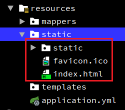

## 1. 项目概述

MoonZero 个人管理系统项目（包括资源、将来计划的个人财产管理系统，或者以后增加更多的想法）。是基于 Vue/Element UI 和 Spring Boot、Spring Cloud、Spring Cloud Alibaba 前后端分离的分布式微服务架构

- **前端工程**

使用开源项目vue-element-admin（vue-element-admin 是一个后台集成解决方案，它基于 vue 和 element。它使用了最新的前端技术栈，内置了 i18 国际化解决方案，动态路由，权限验证，提炼了典型的业务模型，提供了丰富的功能组件，它可以帮助你快速搭建企业级中后台产品原型。）

项目创建使用vue-admin-template（这是一个 极简的 vue admin 管理后台 它只包含了 Element UI & axios & iconfont & permission control & lint，这些搭建后台必要的东西。）开发

- **后端工程**

spring boot + spring cloud，spring + springMVC + Mybatis(MyBatis-plus)

- **数据库**

MySQL

> notes: 目前只完成资源管理模块，前端使用vue框架。后面新增的模块可能有会使用react框架

### 1.1. 项目地址

- 项目后端 github 仓库：https://github.com/MooNkirA/moonzero-system
- 项目前端 github 仓库：https://github.com/MooNkirA/moonzero-system-ui

### 1.2. 项目分支

- master 分支：版本主分支
- develop 分支：开发主分支

## 2. 项目架构

### 2.1. 技术选型

#### 2.1.1. 后端技术

|          技术           |         说明          |
| ---------------------- | -------------------- |
| Spring Cloud           | 微服务框架             |
| Spring Cloud Alibaba   | 微服务框架（待改造）     |
| Spring Boot            | 容器+MVC框架           |
| Spring Security Oauth2 | 认证和授权框架（待引入） |
| MyBatis                | ORM框架               |
| MyBatis-plus           | MyBatis增强框架        |
| MyBatisGenerator       | 数据层代码生成(待引入)   |
| Redis                  | 分布式缓存             |
| MySQL                  | 关系型数据库           |
| Druid                  | 数据库连接池           |
| Lombok                 | 简化对象封装工具        |

#### 2.1.2. 前端技术

|    技术     |         说明         |
| ---------- | ------------------- |
| Vue        | 前端框架             |
| Vue-router | 路由框架             |
| Vuex       | 全局状态管理框架      |
| Element    | 前端UI框架           |
| Axios      | 前端HTTP框架         |
| v-charts   | 基于Echarts的图表框架 |

### 2.2. 服务端模块结构说明

> 2022.07.02 进行一次目录结构重构

```
moonzero-system
|-- mz-system-api             # 系统接口统一管理模块
|    |--mz-api-common             # 项目通用接口
|    └──mz-api-jav                # JAV服务接口
|-- mz-system-common          # 系统公共模块
|    |--mz-common-bom             # 项目版本统一管理聚合模块
|    |--mz-common-core            # 公共核心模块
|    |--mz-common-datasource      # 数据源模块，TODO: 后面研究实现多数据源动态切换
|    |--mz-common-log             # 日志模块（未实现）
|    |--mz-common-mybatis         # 数据层操作模块-mybatis-plus
|    |--mz-common-redis           # 缓存模块-redis
|    └──mz-common-swagger         # 通用 swagger 接口文档模块
|-- mz-govern-eureka          # eureka注册中心服务。开发与生产端口：51001和51002(如果做高可用)
|-- mz-govern-gateway         # zuul网关管理服务。开发与生产端口：51101
|-- mz-sdk				      # 项目sdk包，抽取一些功能做成直接运行的jar包
|-- mz-service-jav            # Jav服务模块。开发端口：8080，生产端口：38080
|-- mz-service-mail           # 邮件服务模块。开发与生产端口：38090
|-- mz-system-utils           # 系统公共工具模块
└──project-resources          # 项目相关的资源
```

> - 端口规则：
>     - 38xxx：后端服务应用端口，最后一位预留来做集群
>     - 51xxx：后端公共应用，如：注册中心、网关等，最后一位预留来做集群

### 2.3. 前端框架结构

> 注：`@` 表示 src 目录

- @/mock：存放模拟数据
- @/page：页面主要界面vue文件，如：登陆、登陆后主界面、锁屏页面等
- @/views：视图vue文件，路由控制
- @/const：存放项目的常量与数据字典数据

### 2.4. 涉及技术

|   技术框架    |      版本      |       说明       |
| ------------ | ------------- | --------------- |
| Spring Boot  | 2.1.7.RELEASE | 容器+MVC框架      |
| Spring Cloud | Greenwich.SR2 | 微服务全套解决方案 |
| Swagger-UI   | 2.7.0         | 接口文档生成工具   |
| Lombok       | 1.18.8        | 简化对象封装工具   |
| MyBatis      | 3.1.2         | ORM框架          |
| mybatis-plus | 3.1.2         | MyBatis增强插件   |

### 2.5. 数据库表结构说明

#### 2.5.1. JAV 服务

|      表名      |       说明       |
| ------------- | --------------- |
| jav_actor     | 出演者表          |
| jav_actor_rel | 资源与出演者关系表 |
| jav_category  | 资源分类表        |
| jav_main      | 资源主列表        |
| jav_storage   | 资源存储表        |

> - 正式环境数据库：jav_db
> - 开发测试环境数据库：jav_db_test

环境

## 3. 开发环境部署

### 3.1. 数据库初始化（windows）

- 版本： mysql5.7.8+
- 默认字符集: utf8mb4
- 默认排序规则: utf8mb4_general_ci

脚本说明：

```
moonzero-system\document\db\DDL-jav.sql        # JAV数据库建表语句
moonzero-system\document\db\DML-init-jav.sql   # JAV数据库数据初始化
```

### 3.2. node 环境准备

检查 node 版本是否为14 

```shell
# 查看 node 版本
node -v 

# 若高版本node 可执行 n 命令切换至 14版本
n 14.16.1
```

### 3.3. 配置本地 hosts

> tips: 推荐使用 SwitchHosts! 修改系统 host 文件

配置项目使用的相关域名

```
# 个人项目配置域名
127.0.0.1  www.jav.com
127.0.0.1  image.jav.com

127.0.0.1  eureka01
127.0.0.1  eureka02
```

### 3.4. 前端工程

```bash
# Install dependencies安装依赖
npm install

# 构建测试环境（Serve with hot reload at localhost:9528）
npm run dev
```

- JAV模块访问地址：http://localhost:9528/#/

### 3.5. 服务端工程

#### 3.5.1. 服务部署列表

> tips: 项目均为本地部署，ip 为 127.0.0.1

|            服务名            |     端口      |              API 访问地址               |
| --------------------------- | ------------ | -------------------------------------- |
| Eureka 注册中心服务（单机版）   | 51001        | http://127.0.0.1:51001/                |
| Eureka 注册中心服务（高可用版） | 51001、51002 |                                        |
| Gateway 网关服务              | 51101        | http://127.0.0.1:51101/moon-system-api |
| JAV 模块服务                  | 8080         | http://127.0.0.1:8080/jav              |
| Mail 邮件模块服务             | 38090        |                                        |

> notes:
>
> - ~~开发swagger文档：http://127.0.0.1:8080/jav/swagger-ui.html~~（暂未引入）

#### 3.5.2. 服务启动配置

> tips: 大部分工程均已配置默认值，直接使用 idea 通过入口类启动即可，也可根据实际情况，修改 VM option 进行以下配置。建议按以下顺序启动：

- Eureka 注册中心服务（单机版）

```bash
-Dserver.port=51001 -DEUREKA_SERVER=http://127.0.0.1:51001/eureka/
```

- **Eureka 注册中心服务（高可用版、可选）**

1. 放到配置文件中的注释部分

```yml
eureka:
  # 高可用版本时配置
  instance:
    hostname: ${EUREKA_DOMAIN} # 如果指定EUREKA_DOMAIN的值则使用，如果不指定，则默认为eureka01，需要配置本地host文件映射，如：127.0.0.1 eureka01
```

2. 分别启动两个实例：127.0.0.1:51001 和 127.0.0.1:51002。（*注：eureka01、eureka02 需要配置本地的hosts文件中映射*）

```bash
# eureka01设置VM options
-Dserver.port=51001 -DEUREKA_SERVER=http://eureka02:51002/eureka/ -DEUREKA_DOMAIN=eureka01
# eureka02设置VM options
-Dserver.port=51002 -DEUREKA_SERVER=http://eureka01:51001/eureka/ -DEUREKA_DOMAIN=eureka02
```

- Gateway 网关服务

```bash
# gateway设置VM options启动参数（eureka单机版）
-Dserver.port=51101 -DEUREKA_SERVER=http://localhost:51001/eureka/ -DIP_ADDRESS=127.0.0.1

# gateway设置VM options启动参数（eureka高可用版）
-Dserver.port=51101 -DEUREKA_SERVER=http://localhost:51001/eureka/,http://localhost:51002/eureka/ -DIP_ADDRESS=127.0.0.1
```

- JAV 模块服务

```bash
# 设置VM options启动参数（单Eureka）
-Dserver.port=8080 -DEUREKA_SERVER=http://localhost:51001/eureka/ -DIP_ADDRESS=127.0.0.1

# 设置VM options（Eureka集群）
-Dserver.port=8080 -DEUREKA_SERVER=http://localhost:51001/eureka/,http://localhost:51002/eureka/ -DIP_ADDRESS=127.0.0.1
```

- Mail 邮件模块服务。启动必配项：`MAIL_HOST`、`MAIL_USERNAME`、`MAIL_PWD`

```bash
# 设置VM options启动参数（单Eureka）
-Dserver.port=38090 -DEUREKA_SERVER=http://localhost:51001/eureka/ -DIP_ADDRESS=127.0.0.1 -DMAIL_HOST=smtp.139.com -DMAIL_USERNAME=xxx@xxx.com -DMAIL_PWD=xxx

# 设置VM options（Eureka集群）
-Dserver.port=38090 -DEUREKA_SERVER=http://localhost:51001/eureka/,http://localhost:51002/eureka/ -DMAIL_HOST=smtp.139.com -DMAIL_USERNAME=xxx@xxx.com -DMAIL_PWD=xxx
```

## 4. 生产环境项目部署

### 4.1. 前端工程

```bash
# 构建生产环境（Build for production with minification）
npm run build:prod


# 构建生产并查看捆绑分析器报告（Build for production and view the bundle analyzer report）
npm run build --report
```

打包完成后，将 dist 目录的内容放到没有中文与特殊符号的目录。

#### 4.1.1. 部署方式一：spring boot+vue

1. 配置前端vue项目的config/prod.env.js文件。修改生产环境的请求`BASE_API`，这里配置为域名是为了后面使用nginx反向代理，不必因为后端部署到不同的服务器或者不同的端口而每次都要重新打包


2. 使用命令`npm run build`构建vue项目.会打包到dist文件夹，里面生成一个static文件夹和一个index.html文件。直接将vue构建后的文件直接全部放置到 resources/static 目录下。这样整合后index.html也是作为一个静态资源出现的。



3. 修改host文件，增加配置域名映射


4. 修改nginx配置文件`\conf\nginx.conf`，增加后端项目部署的地址。配置好之后，前端请求`www.jav.com`时由nginx转向请求`http://127.0.0.1:8080`。这样后端项目使用IDE运行或者打包到tomcat部署时，只需要修改nginx.cof文件即可，前端不需要重新编译打包

```conf
server {
	listen       80;
	server_name  www.jav.com;

	proxy_set_header X-Forwarded-Host $host;
	proxy_set_header X-Forwarded-Server $host;
	proxy_set_header Host $host;

	location / {
		   proxy_pass http://127.0.0.1:8080;
		   proxy_connect_timeout 600;
		   proxy_read_timeout 600;
	}
}
```

#### 4.1.2. 部署方式二（使用）：前后端分离部署

> 以jav模块为例，其他前端项目相同操作

1. 将前端页面工程使用`npm run build:prod`命令，编译打包部署到 nginx 中，作为静态资源，映射域名 www.jav.com，监控 80 端口

```conf
server {
	listen       80;
	server_name  www.jav.com;

	proxy_set_header X-Forwarded-Host $host;
	proxy_set_header X-Forwarded-Server $host;
	proxy_set_header Host $host;

	# 配置jav模块打包后静态资源
	location / {
		   root D:\deployment-environment\moon-system-jav;
	}

	# 配置部署生产环境前端请求后端的服务接口地址
	location ^~ /api-jav/ {
			# 配置后，请求http://www.jav.com/api-jav/jav/main 
			# 相当于请求http://127.0.0.1:51101/moon-system-api/jav/main 网关服务
			proxy_pass http://gateway_server_pool/moon-system-api/jav/;
			proxy_connect_timeout 600;
			proxy_read_timeout 600;
	}
    
}

# 方便日后配置高可用后端服务，gateway工程
upstream gateway_server_pool {
	server 127.0.0.1:51101 weight=10;
}
```

### 4.2. 服务端工程

> tips: 以下打包命令均在相应模块的根目录下执行，运行命令均在jar所在目录下执行

#### 4.2.1. 模块打包与运行

- 父工程（mz-common、mz-api 等公共模块）安装。在打包其他服务模块之前，需要将相关的公共模块都安装到本地仓库（或者偷懒直接安装父工程）。到父工程根目录，执行以下命令

```bash
mvn clean install -Dmaven.test.skip=true
```

> 注：这里安装，没有特别的需求时，最好不要指定环境（如：`-P pro`），使用默认即可。否则在本地开发时可能就会启动了非默认的其它环境

- Eureka 注册中心服务

```bash
# 打包
mvn clean package -P pro -Dmaven.test.skip=true

# 默认配置运行
java -jar mz-govern-eureka.jar

# 自定义配置运行
java -jar mz-govern-eureka.jar --server.port=51001 -DEUREKA_SERVER=http://localhost:51001/eureka/ -DIP_ADDRESS=127.0.0.1

# ------- 高可用版运行 -----------
# eureka01
java -jar mz-govern-eureka.jar --server.port=51001 -DEUREKA_SERVER=http://eureka02:51002/eureka/ -DEUREKA_DOMAIN=eureka01
# eureka02
java -jar mz-govern-eureka.jar --server.port=51002 -DEUREKA_SERVER=http://eureka01:51001/eureka/ -DEUREKA_DOMAIN=eureka02
```

如果部署是高可用版，需要将配置文件中的注释部分再进行打包

```yml
eureka:
  # 高可用版本时配置
  instance:
    hostname: ${EUREKA_DOMAIN} # 如果指定EUREKA_DOMAIN的值则使用，如果不指定，则默认为eureka01，需要配置本地host文件映射，如：127.0.0.1 eureka01
```

- Gateway 网关服务

```bash
# 打包
mvn clean package -P pro -Dmaven.test.skip=true

# 运行（参数均可选）
java -jar mz-govern-gateway.jar --server.port=51101 -DEUREKA_SERVER=http://localhost:51001/eureka/ -DIP_ADDRESS=127.0.0.1

# eureka高可用时运行（EUREKA_SERVER 参数必须配置）
java -jar mz-govern-gateway.jar --server.port=51101 -DEUREKA_SERVER=http://localhost:51001/eureka/,http://localhost:51002/eureka/ -DIP_ADDRESS=127.0.0.1
```

- JAV 模块服务

```bash
# 打包
mvn clean package -P pro -Dmaven.test.skip=true

# 运行（参数均可选）
java -jar mz-service-jav.jar --server.port=38080 -DEUREKA_SERVER=http://localhost:51001/eureka/ -DIP_ADDRESS=127.0.0.1

# eureka高可用时运行（EUREKA_SERVER 参数必须配置）
java -jar mz-govern-gateway.jar --server.port=38080 -DEUREKA_SERVER=http://localhost:51001/eureka/,http://localhost:51002/eureka/ -DIP_ADDRESS=127.0.0.1
```

- mail 邮件模块服务（暂无）

#### 4.2.2. 服务部署列表

> tips: 项目均为本地部署，ip 为 127.0.0.1

|            服务名            |     端口      |              API 访问地址               |
| --------------------------- | ------------ | -------------------------------------- |
| Eureka 注册中心服务（单机版）   | 51001        | http://127.0.0.1:51001/                |
| Eureka 注册中心服务（高可用版） | 51001、51002 |                                        |
| Gateway 网关服务              | 51101        | http://127.0.0.1:51101/moon-system-api |
| JAV 模块服务                  | 38080        | http://127.0.0.1:38080/jav             |
| Mail 邮件模块服务             | 38090        |                                        |

## 5. 项目功能开发

### 5.1. 邮件服务批量上传邮件测试命令

- 使用idea编写启动的脚本，在VM options中增加定义环境变量的脚本

```bash
-DMAIL_HOST=smtp.139.com -DMAIL_USERNAME=xxx@xxx.com -DMAIL_PWD=xxxx -DMAIL_SEND_TO=xxx@xxx.com
```

> tips: 各邮箱服务地址：
>
> - 139邮箱：smtp.139.com
> - 126邮箱：smtp.126.com
> - 163邮箱：smtp.163.com

## 6. 项目版本修改记录

### 6.1. ver2.0.0(待开发)

#### 6.1.1. 项目待实现功能

- [ ] 图片列表显示的位置需要优化，有时一行只显示一张图片
- [ ] 修改主资源表数据时，无论新增还是更新，都是重新去查询出演者列表，生成json字符串数据。需要优化成，当修改的时候，如果与数据库原来的出演者数据一致，就不需要去调用转换出演者字符串方法。
- [ ] 规范代码分层，service层只能调用自己相应的dao层，其他dao只能通过其他的service进行访问
- [ ] 引入消息中间件（RabbitMQ或者activeMQ）服务。如：更新分类与存储位置后，删除redis中缓存数据；修改资源存储为本地存储后，更新主资源表是否保存的字段值等等。
- [ ] 引入Spring task，JAV模块增加定时任务，定时扫描统计更新出演者的作品总记录数
- [ ] 增加用户登陆授权模块
- [ ] 增加统计图

#### 6.1.2. 待修复内容

- [ ] 出演者列表页面增加备注的搜索条件
- [ ] 出演者列表查询接口增加备注的搜索条件
- [ ] 主资源列表页面，缓存搜索条件与分页条件

### 6.2. ver1.1.0 更新日志

#### 6.2.1. 后端工程

- [x] 新增 jav_actor_rel 资源与出演者关系表
- [x] jav_main 收藏影片主表增加 mosaic 字段 
- [x] 调整原有表的索引名称与部分字段类型
- [x] 将 jav_main 中 actor_ids 字段数据迁移至 jav_actor_rel 表

#### 6.2.2. 前端工程

- [x] 资源列表与编辑页面，增加显示新的字段展示与操作

### 6.3. ver1.0.1 更新日志

#### 6.3.1. 后端工程

- [x] 新增主资源详情查询接口
- [x] 新增出演者详情查询接口
- [x] 重构后端工程模块结构
- [x] 重构出演者批量新增功能处理逻辑

#### 6.3.2. 数据库

- [x] 修改 jav_main 表，增加出演者身高字段、`pk_id` 主键，将原来的 `id` 字段改成唯一约束
- [x] 调整 JAV 数据库全部表，将 `gmt_modified`、`gmt_create` 字段分别修改为 `update_time`、`create_time`

#### 6.3.3. 前端工程

- [x] 重构页面
- [x] 出演者模块增加身高字段的数据
- [x] 前端统一增、删、改的提示信息弹出框处理，减少页面的重复代码
- [x] 增加按钮提交后置灰功能，防止重复提交的问题
- [x] 前端主资源录入时增加转大写按钮，并在点击转大写按钮后将输入框的内容复制到剪切板中
- [x] 修改请求处理响应逻辑，调整后端新的返回响应

### 6.4. ver1.0.0 更新日志

#### 6.4.1. 后端工程

- 后端架构改成spring cloud微服务架构，使用nginx实现前后端分离
- 增加eureka注册中心
- 增加zuul网关服务，统一管理请求
- 增加出演者管理、资源分类管理、资源存储位置管理等三个模块
- 引入redis缓存分类与存储位置等字典数据

#### 6.4.2. 数据库

- 资源存储位置jav_storage表增加是否为本地存储is_local字段；
- 出演者jav_actor表将是否删除is_delete字段修改为状态status字段；
- 主资源表jav_main表增加评分grade字段

#### 6.4.3. 前端工程

- 增加出演者管理、资源分类管理、资源存储位置管理等三个模块
- 优化页面样式与逻辑
- 增加主资源管理模块中，资源分类与资源存储位置动态查询后端数据库

### 6.5. ver0.2.0 更新日志

#### 6.5.1. 后端工程

- 修改日志中文乱码的问题
- 修复jav服务main模块的请求url

#### 6.5.2. 前端工程

- 优化jav模块main列表查询页面
- 更新请求main模块请求的url
- 更新main模块列表页面，增加图片显示功能，和更新图片列表与文字列表显示切换的功能。

### 6.6. ver0.1.0 更新日志

#### 6.6.1. 后端工程

- 更新JavMain主资源表中storage_ids字段保存格式，改成只存储位置id，使用“,”分隔
- 优化后端项目的逻辑，优化统一返回结果对象，增加全局的异常处理
- 使用Restful风格请求
- 使用java8 新特性 stream 流去做逻辑处理
- 将原来使用通用mapper为持久层操作工具，换成使用mybatis-plus为持久层操作框架
- 升级faseJson版本至1.2.56，在1.2.48及以下版本，无需Autotype开启，攻击者即可通过构造的请求包在使用fasejson的服务器上进行远程代码执行
- 优化新增出演者字符串使用流转换；在更新主资源数据时，对出演者与原记录的出演者字符串进行比较判断，如果原来记录为空，则直接转换，如果原有记录有值，则判断只去转换新增部分

#### 6.6.2. 前端工程

- 优化数据字典数据，优化修改与详情中的存储位置显示逻辑
- 修复更新数据成功，列表不自动刷新，导致再次更新数据时显示上一次数据
- 使用Restful风格请求
- 修复前端选择每页大小后，不能使用当前每页大小去查询，需要点击翻页或者查询后，第二次请求才生效

### 6.7. ver0.0.1

- 完成JavMain主资源表的新增、修改、删除、多条件查询功能

## 7. 其他内容备份

### 7.1. ~~项目打包命令（war版本，已弃用）~~

> 注：此方式已经弃用了

需要将依赖的公共包安装到本地仓库，到时需要依赖打包到war包中

项目打包：参考前面将前端部署后，因为配置了开发环境与正式版本环境的两套配置文件，使用maven命令打包时，需要输入配置文件的参数，进行打包即可，完成后将war包放到tomcat运行部署

```bash
# 项目安装（更新安装所有依赖的公共模块）
mvn clean install -DactiveName=pro -Dmaven.test.skip=true

# 项目打包（相应的模块）
mvn clean package -DactiveName=pro -Dmaven.test.skip=true
```


### 7.2. 使用tomcat 部署 war 包

- JAV模块服务部署地址：127.0.0.1:38080

```bash
# 先安装父目录，保证依赖的公共模块是最新的
mvn clean install -DACTIVE_NAME=pro -Dmaven.test.skip=true

# 打包JAV模块（eureka高可用版）
mvn clean package -DACTIVE_NAME=pro -DSERVER_PORT=38080 -DEUREKA_SERVER=http://localhost:51001/eureka/,http://localhost:51002/eureka/ -DIP_ADDRESS=127.0.0.1 -Dmaven.test.skip=true

# 打包JAV模块（eureka单机版）
mvn clean package -DACTIVE_NAME=pro -DSERVER_PORT=38080 -DEUREKA_SERVER=http://localhost:51001/eureka/ -DIP_ADDRESS=127.0.0.1 -Dmaven.test.skip=true
```

> 因为定义了该项目的根目录是/jav。而且不是直接使用spring boot打包成jar包，是单独部署到tomcat的，所以需要将tomcat的根目录修改为/jav，并指向项目war解压后所在的路径
>
> 修改tomcat目录的\conf\server.xml，在`<host>`标签内增加`<Context>`标签，指定web项目的根路径与源代码所在目录

```xml
<Host name="localhost"  appBase="webapps"
        unpackWARs="true" autoDeploy="true">

    <!-- SingleSignOn valve, share authentication between web applications
         Documentation at: /docs/config/valve.html -->
    <!--
    <Valve className="org.apache.catalina.authenticator.SingleSignOn" />
    -->

    <!-- Access log processes all example.
         Documentation at: /docs/config/valve.html
         Note: The pattern used is equivalent to using pattern="common" -->
    <Valve className="org.apache.catalina.valves.AccessLogValve" directory="logs"
           prefix="localhost_access_log" suffix=".txt"
           pattern="%h %l %u %t &quot;%r&quot; %s %b" />
           <!-- 指定tomcat访问的根据目录
                path是说明虚拟目录的名字，如果要只输入ip地址直接显示主页，则该键值留为空；
                docBase是虚拟目录的路径，它默认的是$tomcat/webapps/ROOT目录，现在在webapps目录下建了一个jav目录，让该目录作为默认目录。
                debug和reloadable一般都分别设置成0和true。
            -->
    	<Context path="/jav" docBase="D:\deployment-environment\tomcat-9.0.5-javProject-port38080\webapps\jav\"
                 debug="0" reloadable="true" />
</Host>
```
